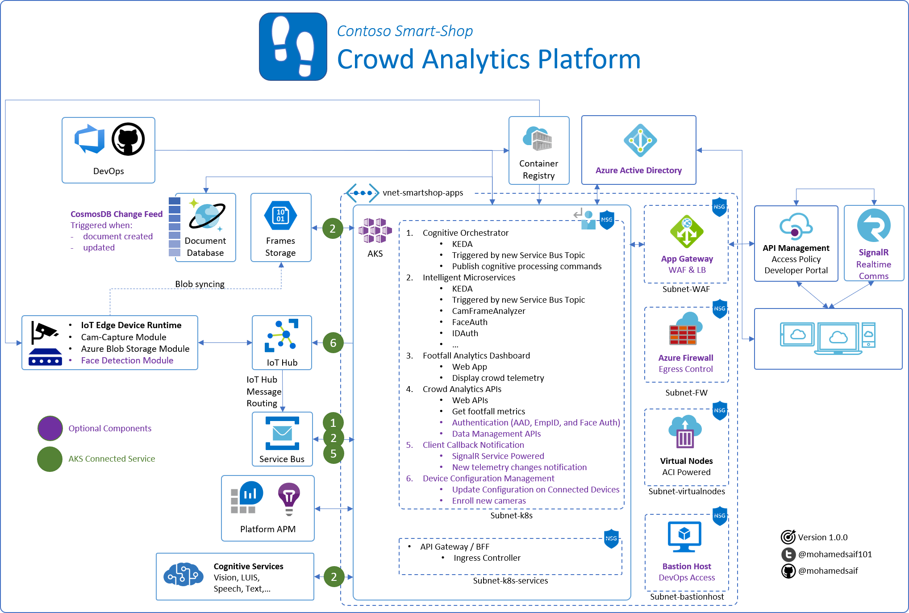
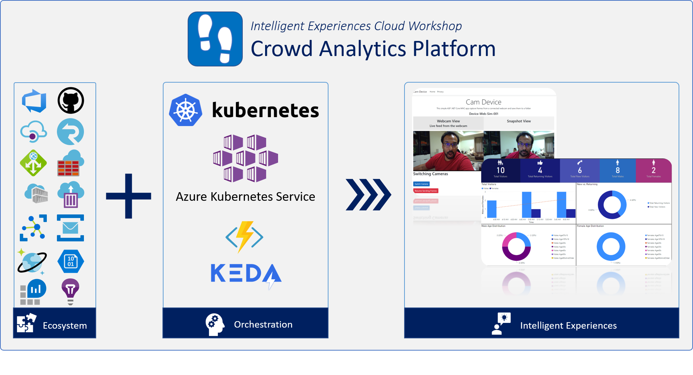

# Intelligent Experiences On Containers

Hands-on workshop to create containers-based backend platform that exposes async AI services

|Service|Build|Release|
|-|-|-|
|Cognitive Orchestrator|||
|Cam-Frame Analyzer|||
|Crowd Analyzer|||
|Core Lib|||
|Cognitive Services Helper|||

## Overview

Follow this detailed walk through guide to see how a Crowd Analytics platform, built on Azure, can provide occupancy insights in a workspace, or some other location, while having technical fun with an AI-driven platform on Kubernetes.

Almost all enterprises already operate networked CCTV cameras in their buildings and stores. This Crowd Analytics Platform extend the capabilities of these cameras to include additional useful intelligence, to improve customer experience and safety trough AI.

>NOTE: It is important to mention before diving into the platform that leveraging and designing AI powered solutions should always adhere to responsible and ethical principles that reflect trust and timeless values. I personally like Microsoft's principles about fairness, inclusiveness, reliability, safety, transparency, privacy, security and accountability. [Read more](https://www.microsoft.com/en-us/AI/our-approach-to-ai)

### Crowd Analytics

Crowd analytics (also known as footfall analytics) is about gaining a better understanding of the demographics (age, gender,...) of who is visiting your location, when they are visting and how many are visting.

This workshop walks through a guided deployment of a connected, secure and reliable **Crowd Analytics** platform, leveraging cloud native technologies.

Crowd analytics scenarios can be used in:

1. Retail shops in many industries (like telecom shops, consumer goods retailers, malls…)
2. Public and Private Parks
3. Events
4. Building safety and evacuation readiness
5. And many other scenarios

Advanced cloud technologies can provide key business metrics that allow stakeholders to make informative decisions on how to improve experience and/or performance.

### Open Source and Azure Technologies

Azure already provides a sophisticated platform to develop and operate such a system, and the **Crowd Analytics** platform makes use of a number of Azure's services.

**Kubernetes** has become the defacto cloud native technology to develop and operate sophisticated containerized systems anywhere, and Azure Kubernetes Service (AKS) takes care of a lot of the cluster management tasks, allowing you to focus more on the solution you want to build.

Key technologies used in the workshop include:

- Azure Kubernetes Service (AKS)
- Azure Container Registry (ACR)
- Azure Service Bus
- Azure IoT Hub
- Azure Cognitive Services
- Azure Storage
- Azure DevOps
- Power BI
- and many more

I'm really excited to share with you the great journey I took to build this system.

## Workshop Agenda

1. [Dev Environment Setup](guide/00-setup/README.md)
    - Visual Studio Code
    - Azure CLI
    - Other tools
2. [Solution Whiteboarding & Architecture](guide/01-architecture/README.md)
    - Walkthrough the system objectives
    - Review Azure architecture
3. [Creating Azure Prerequisites](guide/02-prerequisites/README.md)
    - Resource Group
    - Storage Account
    - Cosmos DB
    - Service Bus
    - Cognitive Service
    - Container Registry
    - Virtual Network
    - Log Analytics
    - App Insights for each app
4. [AKS Cluster](guide/03-aks/README.md)
    - Essential kubernetes cluster provisioning
    - Kubernetes cluster preparations
5. [Creating IoT Hub and IoT Edge Device](guide/04-iot/README.md)
    - IoT Hub Provisioning
    - Message Routing to Service Bus
    - Device Options
    - Workshop Device Setup
6. [Services Deployment & Testing](guide/05-deployment/README.md)
    - Connecting to Azure
    - Source Code
    - Continuos Integration
    - Continuos Delivery
    - Testing
7. [Data Visualization](guide/06-dashboard/README.md)
    - Power BI Desktop
    - Connecting to Cosmos Db
    - Query edit and data prep
    - Design the report
    - Publish the report
8. BONUS Track: Crowd Analytics APIs
    - Overview
    - Deployment
    - API Testing
9. BONUS Tracks (coming soon)
    - Advanced AKS Provisioning
        - AKS Preview Features
        - Azure AD Integration
        - Helm initialization
        - Node pools (with Windows Pool)
        - Virtual Nodes
        - Application Gateway Ingress Controller
        - Azure Firewall and Egress Lockdown
    - API Management
    - Azure AD Integration
    - Realtime Communication
        - Cosmos DB Change Feed
        - SignalR client communication
    - IoT Edge Deployment
        - IoT Edge on Kubernetes
        - Custom Modules
        - IoT Edge on Raspberry Pi with USB Camera

## Suggested 1-Day Workshop Agenda

Topic|Duration
-----|:--------:
Registration and Setup|15 mins
Why Intelligent Experiences?|20 mins
Intelligent Retail - Crowd Analytics Overview|25 mins
Break|  
Solution White-boarding|30 mins
Lab - Azure Services Provisioning|60 mins
Lab - AKS Provisioning|60 mins
Lunch|  
Lab - IoT Hub Provisioning|30 mins
Lab - DevOps & Services Deployment|90 mins
Break|  
Lab - Dashboard & Data Visualization|30 mins
Q and A + Next Steps|30 mins
Bonus Workshop Material (Take home tasks)|  
Bonus 1 - Advanced AKS Provisioning|-
Bonus 2 - IoT Edge Development|-

## About the project

I tried to make sure I covered all aspects and best practices while building this project, but all included architecture, code, documentation, and any other artifact represent my personal opinion only. Think of it as a suggestion of one way in which this platform could be built.

Keep in mind that this is a work-in-progress, and I will continue to contribute to it when I can.

All constructive feedback is welcomed 🙏

## Support

You can always create issue, suggest an update through PR or direct message me on [Twitter](https://twitter.com/mohamedsaif101).

## Contributors

### Cognitive-Samples-IntelligentKiosk

Part of this workshop source code is based on [Cognitive-Samples-IntelligentKiosk](https://github.com/microsoft/Cognitive-Samples-IntelligentKiosk). Visit the GitHub repo to know more about all of the great capabilities of Azure Cognitive Services.

### HTML5 UserMedia

Using a webcam through HTML5/JS code based partially on the great demo from [DaveVoyles](https://github.com/DaveVoyles/GetUserMedia-sample)

## Author

|                  |
|:----------------------------------------------:|
|                 **Mohamed Saif**               |
|     [GitHub](https://github.com/mohamedsaif)   |
|  [Twitter](https://twitter.com/mohamedsaif101) |
|         [Blog](http://blog.mohamedsaif.com)    |

## License

All Intelligent Experiences On Containers documentation and samples are licensed with the MIT License. For more details, see [LICENSE](LICENSE)

## Developer Code of Conduct

The image, voice, video or text understanding capabilities of the Intelligent Kiosk Sample uses Microsoft Cognitive Services. Microsoft will receive the images, audio, video, and other data that you upload (via this app) for service improvement purposes. To report abuse of the Microsoft Cognitive Services to Microsoft, please visit the Microsoft Cognitive Services website at [https://www.microsoft.com/cognitive-services](https://www.microsoft.com/cognitive-services), and use the “Report Abuse” link at the bottom of the page to contact Microsoft. For more information about Microsoft privacy policies please see their privacy statement here: [https://go.microsoft.com/fwlink/?LinkId=521839](https://go.microsoft.com/fwlink/?LinkId=521839).

Developers using Cognitive Services, including this sample, are expected to follow the “Developer Code of Conduct for Microsoft Cognitive Services”, found at [http://go.microsoft.com/fwlink/?LinkId=698895](http://go.microsoft.com/fwlink/?LinkId=698895)
