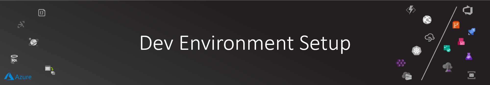

# Dev Environment Setup

These are the steps to follow for one of the ways in which you can get your environment ready to start developing and deploying cloud-native solutions targeting Azure.

## Azure Subscription

To complete this how-to, you need an Azure subscription.

You can leverage an organization provided subscription or [Visual Studio subscription](https://my.visualstudio.com/) benefit.

If you don't have an Azure subscription, create a [free account](https://azure.microsoft.com/free) before you begin.

Once you have an Azure subscription, you can visit [Azure Portal](https://portal.azure.com) to access your subscription at any time.

## WSL on Windows 10 PC

As you build software that leverages Open Source, and you are still in love with your Windows 10 PC, I would highly recommend enabling [Windows Subsystem for Linux (WSL)](https://docs.microsoft.com/en-us/windows/wsl/install-win10) as many of the commands in this guide assume you have access to a bash shell.

Please follow the instructions in the documentation link above to get started.

>NOTE: If you want to use the new WSL 2, follow this documentation link: [Installing WSL 2](https://docs.microsoft.com/en-us/windows/wsl/wsl2-install)

## Git for Windows

If this is the first time using Git on your dev machine, you might need to install Git on your system.

You can download and install Git from [here](https://git-scm.com/downloads)

## Azure CLI

Download and install [Azure CLI](https://docs.microsoft.com/en-us/cli/azure/install-azure-cli?view=azure-cli-latest) for your relevant OS.

>NOTE: At the time of writing the code, I used version 2.3.0. Make sure you are running same or later version. Check with ```az --version```

Once installed, you can use the following commands to login to Azure through the Azure CLI, and to ensure you specify the subscription you intend to use:

```bash

# Login to Azure (this will launch the Azure login prompt if you are not already logged in)
az login

# Show which subscription your az CLI commands are set to use
az account show

# If the account details shown are not the ones you want to use, find the id of the subscription you want to use and then execute the below commands to set the context of the CLI to a specific subscription (replace 00000000-0000-0000-0000-000000000000 with your subscription id)
az account set --subscription 00000000-0000-0000-0000-000000000000

```

## Kubectl

Kubectl is the CLI for accessing the kubernetes APIs.

You can use Azure CLI to install the kubectl:

```bash

az aks install-cli

```

If necessary, follow the [documentation here](https://kubernetes.io/docs/tasks/tools/install-kubectl/) to install on your target OS.

## Helm 3

Helm is the Kubernetes native package manager that is widely used by the community.

>NOTE: We need KEDA (Kubernetes Event-Drive Autoscaler) for our platform. KEDA will be installed on AKS through Helm 3.

To install Helm, you can run the following from within a bash prompt, or following instructions for your OS at [https://helm.sh/docs/intro/install/](https://helm.sh/docs/intro/install/):

```bash

# Check first if you have helm 3 installed
helm version

# If you get a command not found message, then you need to install it (or if you get helm 2 version you need to upgrade)
# Installing helm 3
curl -sL https://raw.githubusercontent.com/helm/helm/master/scripts/get-helm-3 | sudo bash

# OR
# wget https://raw.githubusercontent.com/helm/helm/master/scripts/get-helm-3
# chmod -R +x .
# ./get-helm-3

helm version
# You should get something like:
# version.BuildInfo{Version:"v3.1.2", GitCommit:"d878d4d45863e42fd5cff6743294a11d28a9abce", GitTreeState:"clean", GoVersion:"go1.13.8"}

```

## jq Installation

jq is a JSON data management library that can make JSON manipulation very easy.

jq installation is dependent on your platform OS.

Below is the command you can run under Debian based OS (like Ubuntu):

```bash

sudo apt-get install jq

```

For information on installing it on other platforms like Mac OSX, refer to [jq documentation](https://stedolan.github.io/jq/download/)

## .NET Core SDK

If you will be using this workshop to run some components locally, it is highly recommended that you install .NET Core SDK.

As the microservices in the workshop are written in C#, you need to install [.NET Core SDK here](https://dotnet.microsoft.com/download/dotnet-core/sdk-for-vs-code?utm_source=vs-code&amp;utm_medium=referral&amp;utm_campaign=sdk-install)

Below is the installation for Linux:

```bash

# Adding microsoft packages
wget https://packages.microsoft.com/config/ubuntu/18.04/packages-microsoft-prod.deb -O packages-microsoft-prod.deb
sudo dpkg -i packages-microsoft-prod.deb

# Installing .NET Core SDK
sudo add-apt-repository universe
sudo apt-get update
sudo apt-get install apt-transport-https
sudo apt-get update
sudo apt-get install dotnet-sdk-3.1

```

>NOTE: If you will be running the simulated camera device locally on your machine, you need to have .NET Core SDK as the camera device app is an ASP .NET Core application that runs on your browser.

## Docker Desktop

[Docker Desktop](https://www.docker.com/products/docker-desktop) is the way to go to build cloud-ready containers on your desktop.

>NOTE: Docker Desktop installs a version of kubectl as well

## VS Code

Download and install [VS Code](https://code.visualstudio.com/)

>NOTE: You can also use the full fledged Visual Studio 2019, or later

### VS Code Extension

I would highly recommend installing the following extensions:

- [Remote WSL](https://marketplace.visualstudio.com/items?itemName=ms-vscode-remote.remote-wsl)
- [C#](https://marketplace.visualstudio.com/items?itemName=ms-vscode.csharp)
- [Kubernetes](https://marketplace.visualstudio.com/items?itemName=ms-kubernetes-tools.vscode-kubernetes-tools)
- [Azure Functions](https://marketplace.visualstudio.com/items?itemName=ms-azuretools.vscode-azurefunctions)
- [Azure IoT Tools](https://marketplace.visualstudio.com/items?itemName=vsciot-vscode.azure-iot-tools)

## Azure Functions Core Tools

Follow [the installation guide](https://docs.microsoft.com/en-us/azure/azure-functions/functions-run-local) to make sure it is installed on your target dev environment.

As we will be using [KEDA (Kubernetes-based Event Driven Autoscaling)](https://github.com/kedacore/keda) to deploy event driven APIs as part of the platform services, we will be using Azure Functions Core tools to help with the needed development and kubernetes deployment tooling.

>NOTE: At the time of writing the code, I used Azure Functions Core Tools version 2.7.1948

## Azure Account Check

### Azure Permissions

If you are running the workshop under a restricted subscription (provided by your organization), you need to perform the pre-flight permissions checks.

>NOTE: To validate that you are able execute the workshop under a restricted subscription, I highly recommend executing the [prerequisites guide steps](../02-prerequisites/README.md) ahead of the workshop.

1. Resource Group Owner: Your Azure Account should have "Owner" permission on a Resource Group in your subscription, or be able to create a new resource group.
2. Azure Kubernetes Service (AKS) Service Principal: To provision AKS a Service Principal is used, and you will need permissions to create one or have one that has already been created.
   - The AKS Service Principal will need to have "Contributor" access on the resource group you will be deploying to.
3. Azure Container Register (ACR) Service Principal: To integrate Azure DevOps with ACR, we need a second Service Principal, and you will need permissions to create one or have one that has already been created.
   - The ACR Service Principal will need to have "AcrPull" and "AcrPush" permissions on the project's ACR.

### Resource Providers

Some subscription don't have all Azure resource providers registered. For example if the subscription doesn't have the "Microsoft.DocumentDB" provider registered, you will not be able to create a Cosmos DB resource.

A script to make sure all needed resource providers are registered is available at [00-resource-providers.sh](../../src/scripts/00-resource-providers.sh). Note: a subscription owner account is required to execute this script.

>NOTE: Resource provider registration is a one time job at the subscription level and doesn't have any cost implications (this just enables the subscription to use certain services like ACR, AKS, Cosmos DB,...)

### Azure Subscription Limits

Some accounts (especially trial accounts) have limits on how many vCPUs can be provisioned on the subscription.

AKS will leverage vCPUs for the workers VMs, so you need to make sure you have enough vCPUs of the size you will use for the AKS workers nodes in the target region.

>NOTE: This workshop guide is using Standard BS Family vCPUs (SKU of Standard_B2s), which provides 2 vCPUs per VM, and our AKS cluster will have three VMs for the 3 worker nodes, so you will need a total of at least 6 vCPU.

Below is some guidance on how you can check and deal with that.

```bash

# To view the current limits for a specific location:
az vm list-usage -l 'westeurope' -o table

# Look for the CurrentValue vs. Limit for the following:
# Name                               CurrentValue    Limit
# ---------------------------------  --------------  -------
# Total Regional vCPUs               10              20
# Virtual Machines                   6               25000
# Virtual Machine Scale Sets         1               2500
# Standard BS Family vCPUs           8               20
# Standard DSv3 Family vCPUs         0               20
# Standard DSv2 Family vCPUs         0               20
# Standard Storage Managed Disks     2               50000
# Premium Storage Managed Disks      4               50000

```

You might hit some subscription service provisioning limits during creating the AKS cluster and get something like:

```

compute.VirtualMachinesClient#CreateOrUpdate: Failure sending request: StatusCode=0 -- Original Error: autorest/azure: Service returned an error. 
Status=<nil> Code="OperationNotAllowed" Message="Operation results in exceeding quota limits of Core. Maximum allowed: 0, Current in use: 0
, Additional requested: 6.

```

You might want to check other regions to deploy the resources where you might have available limit.

You can also solve this by submitting a new support request here: [https://aka.ms/ProdportalCRP/?#create/Microsoft.Support/Parameters/](https://aka.ms/ProdportalCRP/?#create/Microsoft.Support/Parameters/)

Use the following details:  
Type: Service and subscription limits (quotas)  
Subscription: Select target subscription  
Problem type: Compute-VM (cores-vCPUs) subscription limit increases  

Click add new quota details (increase from 0 to 10 as the new quota for example).

## Next step

Congratulations on completing this section. Let's move to the next step:

[Next Step](../01-architecture/README.md)
