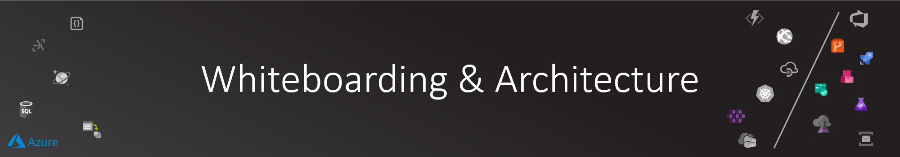
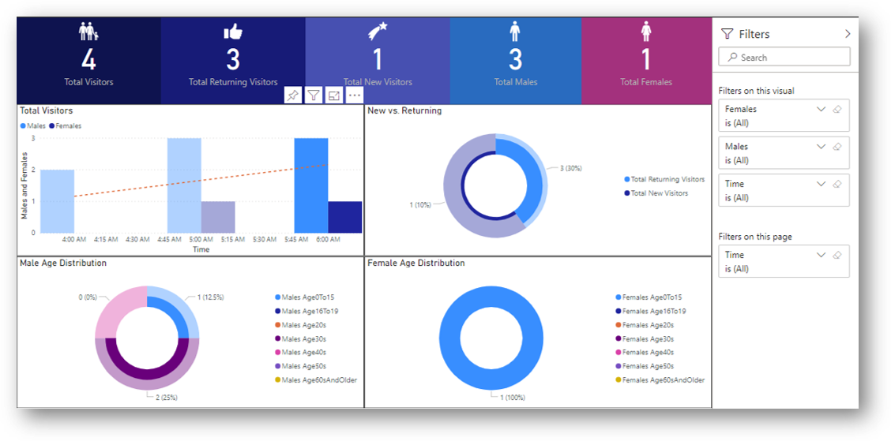
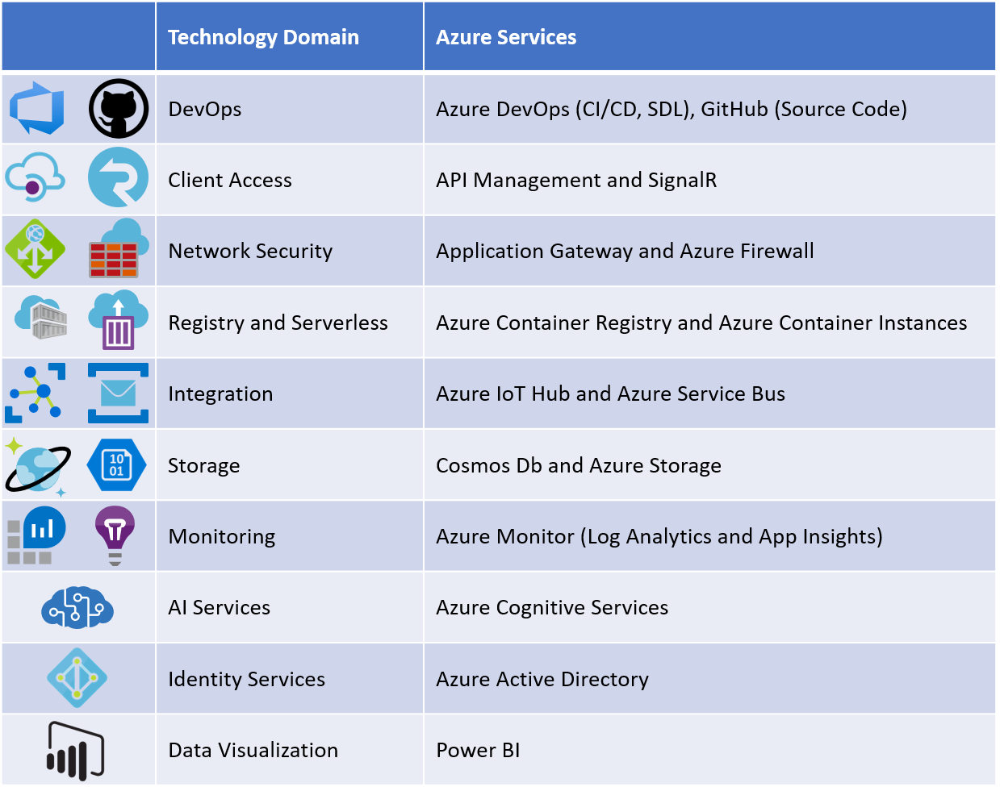

# Whiteboarding & Architecture

## Overview

Crowd analytics (also known as footfall analytics) is about understanding who (age, gender, emotion,...) are visiting your location, when and how many.

Crowd analytics scenario can be used in:

1. Retail shops in many industry (like telecom shops, consumer goods retailers, malls…)
2. Public and Private Parks
3. Events
4. Building safety and evacuation readiness
5. Any many other scenarios

Using advanced cloud native technologies can provide key business metrics that allows stakeholders to make informative decisions to improve experience and/or performance.

### Process Flow

1. Camera Device capture frames and send it a central location
2. Devices Hub receive the camera frame message and route it to designated system for processing
3. An orchestrator service receive the request and route it based on the required target analysis
4. Camera frame analysis service perform AI-powered face detection and store the results in NoSQL database
5. Analysis service pick up the AI-powered analysis and convert it to useful insights that then stored in a database (aggregating results)
6. Business stakeholder access the dashboard with visualized crowd analytics insights.

## Functional Scope

Let's start by understanding Crowd Analytics platform requirements scope without any regard to technology:

- **Camera Device**
  - Sending Frames to cloud storage
  - Sending telemetry to a centralized hub
- **Centralized Hub for Connected Devices**
  - Ability to manage and monitor all connected devices
  - Ability to push configuration changes to all or part of the devices
  - Ability to run in the future intelligent at the edge
  - Devices automatic provision to on-board securely devices at scale
  - Ability to support multiple device communication protocols (HTTPS, AMQP,...)
- **Cognitive Orchestrator Service**
  - Ability to route different AI requests to the appropriate service
    - In our case, a single cognitive type is used (CamFrame-Analysis)
    - Allow for future expansion to route a submitted request to different AI service (like face authentication request)
  - You can integrate any transformation here (receiving one format from devices and transform it to a new format to be consumable by target service)
- **Camera Frame Analyzer Service**
  - Receive a request for a camera frame image to be analyzed
  - Face Detection AI Service: detect faces along with the associated demographics (age, gender and emotion)
  - Persist frame analysis results in a database
  - Publish event that a new analysis is published
- **Crowd Analyzer Service**
  - Receive a message from a newly analyzed camera frame
  - Do appropriate aggregates to convert a single frame analysis into a useful crowd demographics insights
    - Uses a predefined analysis window (by default 60 mins) to aggregate crowd demographics
    - Uses originating device as the context of the analysis (can support multiple devices that are running simultaneously)
  - Persist analytics to a database
  - Publish event that a new or updated demographics information is available
    - Can be used in near-real-time tracking for demographics
- **Cloud Native Orchestrator**
  - Support running containers
  - Ability to manage the infrastructure compute resources
  - Handle services deployment and scheduling
  - Provide auto healing and fault recovery
  - Enterprise grade container registry
- **Integration Service Bus**
  - Microservice architecture depends on messaging and eventual consistency
  - Ability to handle distributed messages at scale
  - Support Pub/Sub pattern
- **Auto Scaler based on Demand**
  - Scaler must be able to scale automatically based on the size of the messages being processed
  - Each service must have the ability to scale independently
  - Ability to scale down to ZERO
  - Serverless: ability to leverage ad-hoc servers on demand
- **Monitoring**
  - Ability to monitor all system components (infrastructure, services and external dependencies)
  - Ability to raise alerts when system is performing below the target performance levels
  - Ability to support near-real-time streaming of logs
- **Security**
  - Identity authentication and authorization protection
  - Network security
  - Firewalls (including Web-Application-Firewall)
  - Encrypted communications
- **DevOps**
  - All services deployments must be automated via CI/CD
  - No secrets shall be checked in the source code
  - All infrastructure components must be provisioned via parametrized scripts
- **Data Visualization**
  - Platform that is business stakeholder friendly
  - Support both web and mobile reporting viewing
  - Support self-service report creation with option to add custom calculations and time series intelligent metrics
  - Ability to share reports
  - Ability to slice and dice reports
  - Secure access based on corporate identity

## Technical Scope

Now mapping the functional scope to the relevant technologies to achieve the target objectives.

## Architecture

Connecting all the above technologies in an architecture to see how each system fit:

## Next step

Congratulations on completing this section. Let's move to the next step:

[Next Step](../02-prerequisites/README.md)