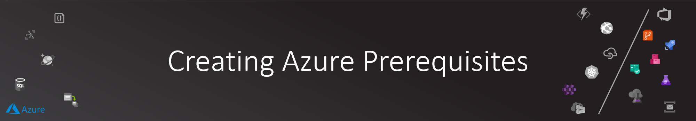
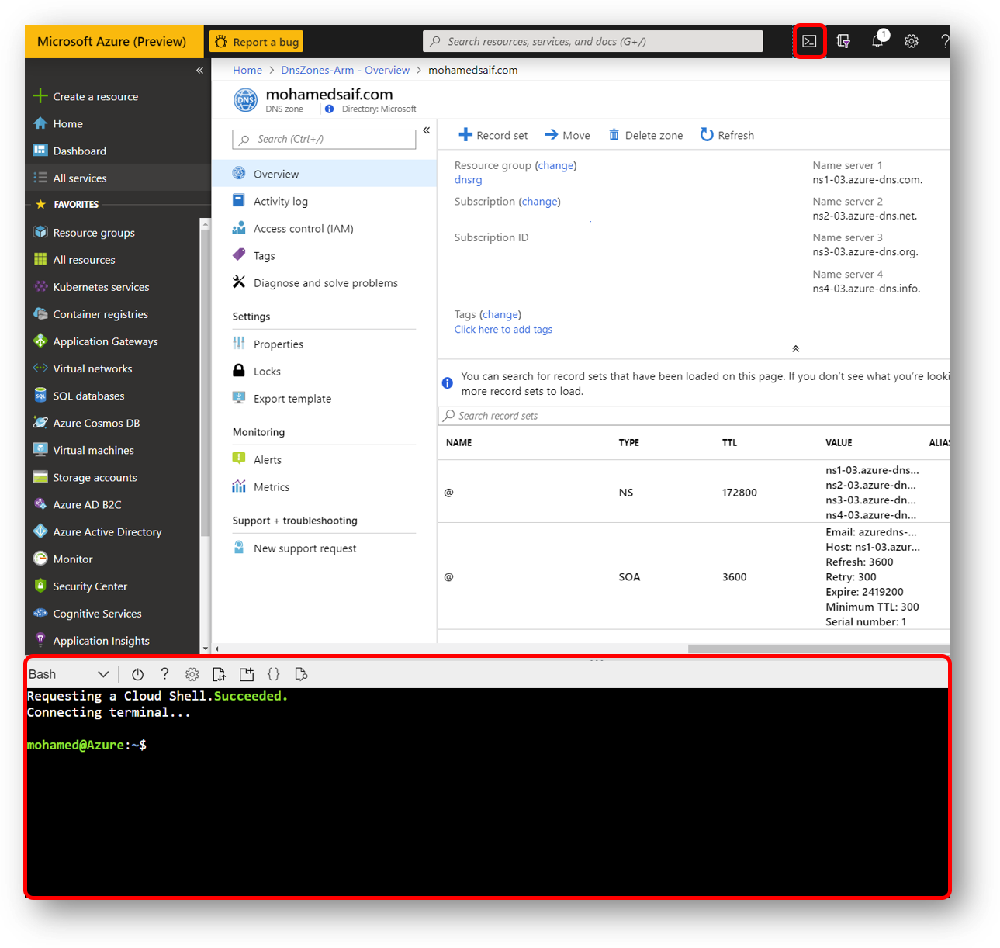
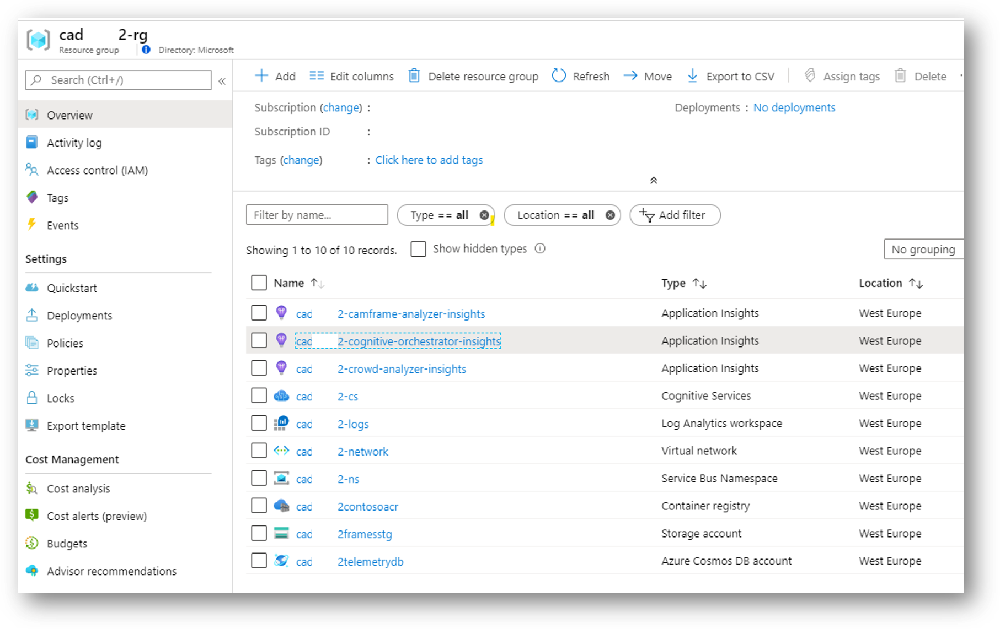

# Creating Azure Prerequisites

Now we are ready to setup our initial Azure resources that will be needed.

>NOTE: You can use the Azure Portal to perform these actions, but I prefer to use scripts as it offer repeatable steps and clear status.

## Prepare your development environment

If you didn't yet finish the recommend setup for this workshop, head to [Setup](../00-setup/README.md) to prepare your development machine for the workshop tasks.

To execute the steps mentioned in this guide, I would recommend strongly using VS Code (and if you are using Windows, to have WSL installed and configured).

If you don't have that ready but you want get started, you can use [Azure Cloud Shell](https://docs.microsoft.com/en-us/azure/cloud-shell/overview) directly from Azure Portal.



## Get the workshop code

I would recommend forking the workshop repo to your GitHub account, then clone it to your development machine.


If you are using Azure Cloud Shell, type this command in the bash session:

```bash

# You can use my repo, or your forked repo url
git clone https://github.com/mohamedsaif/IntelligentExperiences.OnContainers.git

cd IntelligentExperiences.OnContainers

# This will open an online version of VS Code
code .

```

If you are using VS Code, first create a folder to have your code clone to, then in VS Code press Ctrl+P and enter:

```bash

>Git: Clone

```

Then follow the guided steps to clone the repo to a folder in your development machine.

>**SCRIPT:** All scripts to provision the entire resources in this guide are in a single script named **02-prerequisites.sh** under [src/scripts](**../../src/scripts) folder. Please note that you need to execute the scripts after copying it to your terminal and move the active folder to src/scripts

## Azure CLI sign in

Fire up your favorite bash terminal and execute the following commands:

```bash

#***** Login to Azure Subscription *****
# A browser window will open to complete the authentication :)
az login

# You can also login using Service Principal (replace values in <>)
# az login --service-principal --username APP_ID --password PASSWORD --tenant TENANT_ID

az account set --subscription "YOUR-SUBSCRIPTION-NAME"

#Make sure the active subscription is set correctly
SUBSCRIPTION_ACCOUNT=$(az account show)
echo $SUBSCRIPTION_ACCOUNT

# Get the tenant ID
TENANT_ID=$(echo $SUBSCRIPTION_ACCOUNT | jq -r .tenantId)
# or use TENANT_ID=$(az account show --query tenantId -o tsv)
echo $TENANT_ID

# Get the subscription ID
SUBSCRIPTION_ID=$(echo $SUBSCRIPTION_ACCOUNT | jq -r .id)
# or use TENANT_ID=$(az account show --query tenantId -o tsv)
echo $SUBSCRIPTION_ID

clear

#***** END Login to Azure Subscription *****

```

## Setting up deployment variables

I use variables to easily change my deployment parameters across multiple scripts and sessions.

```bash

# Setup some variables for reusability
# Please update the values if you need to use other values but make sure these are unique
# Also make sure to use only lower case to avoid conflict with recourses that requires that.

PREFIX="ie${RANDOM}"
RG="${PREFIX}-rg"
LOCATION="eastus"
FRAMES_STORAGE="${PREFIX}framesstg"
COSMOSDB_ACCOUNT="${PREFIX}telemetrydb"
SB_NAMESPACE="${PREFIX}-ns"
CS_ACCOUNT="${PREFIX}-cs"
CONTAINER_REGISTRY_NAME="${PREFIX}contosoacr"
VNET_NAME="${PREFIX}-network"
WORKSPACE_NAME="${PREFIX}-logs"

```

## Creating Resource Group

Resource Group is your virtual folder that we will provision all of our solution resources.

```bash

# Create a resource group
az group create --name $RG --location $LOCATION

```

## Storage Account

[Azure Storage Account](https://docs.microsoft.com/en-us/azure/storage/common/storage-account-overview) offers a cloud storage for your blobs, files, disks,... We will used it to store captured frames from the connected cameras.

```bash

# Creating Azure Storage account to store camera frames for post processing
az storage account create \
    -n $FRAMES_STORAGE \
    -g $RG \
    -l $LOCATION \
    --sku Standard_LRS

FRAMES_STORAGE_KEY=$(az storage account keys list \
    -n $FRAMES_STORAGE \
    -g $RG \
    --query "[?keyName=='key1'].value" \
    -o tsv)
echo $FRAMES_STORAGE_KEY

# Getting the storage connection string to be used in the apps deployment
FRAMES_STORAGE_CONN=$(az storage account show-connection-string \
    --name $FRAMES_STORAGE \
    --resource-group $RG \
    --query connectionString \
    -o tsv)
echo $FRAMES_STORAGE_CONN

# Creating a blob container for our Camera Frames (name must be all small letters)
#In case of keep getting Authentication Failure, Most probably its due to Date/Time not in sync between WSL2 and Host, try "sudo hwclock -s"
FRAMES_STORAGE_CONTAINER="camframefiles"
az storage container create \
    --account-name $FRAMES_STORAGE \
    --account-key $FRAMES_STORAGE_KEY \
    --name $FRAMES_STORAGE_CONTAINER

```

>NOTE: We are simplifying the storage access by using the keys and connection strings. In production, you should consider leveraging [Stored Access Policies](https://docs.microsoft.com/en-us/rest/api/storageservices/define-stored-access-policy) along with [Shared Access Signature](https://docs.microsoft.com/en-us/rest/api/storageservices/delegate-access-with-shared-access-signature) that is specific to the object being accessed (entire container or a particular file).

## Cosmos DB

```bash

# Creating Cosmos DB account to store all system data
az cosmosdb create \
    -n $COSMOSDB_ACCOUNT \
    -g $RG \
    --default-consistency-level Eventual

# Retrieve Cosmos DB Primary Connection
COSMOSDB_PRIMARY_CONN=$(az cosmosdb keys list \
    --name $COSMOSDB_ACCOUNT \
    --resource-group $RG \
    --type connection-strings \
    --query "connectionStrings[?description=='Primary SQL Connection String'].connectionString" \
    -o tsv)
echo $COSMOSDB_PRIMARY_CONN

```

## Service Bus

Service Bus will be used to offer scalable distributed messaging platform.

```bash

# For distributed async integration, we will be using Azure Service Bus
az servicebus namespace create \
   --resource-group $RG \
   --name $SB_NAMESPACE \
   --location $LOCATION \
   --sku Standard

# Create new authorization rule to use it to connect to the service bus
az servicebus namespace authorization-rule create \
    --resource-group $RG \
    --namespace-name $SB_NAMESPACE \
    --name cognitive-orchestrator-key \
    --rights Manage Send Listen

# We will be using Service Bus's topic/subscription (aka pub/sub pattern) to build our middleware messaging.
# Let's create the topics and subscriptions

# Creating the CognitiveOrchestrator topic and subscription
SB_TOPIC_ORCH="cognitive-request"
az servicebus topic create \
    --resource-group $RG \
    --namespace-name $SB_NAMESPACE \
    --name $SB_TOPIC_ORCH

# Create subscription CognitiveOrchestrator to the topic
SB_TOPIC_ORCH_SUB="cognitive-orchestrator"
az servicebus topic subscription create \
    --resource-group $RG \
    --namespace-name $SB_NAMESPACE \
    --topic-name $SB_TOPIC_ORCH \
    --name $SB_TOPIC_ORCH_SUB

# Creating the CamFrameAnalyzer topic and subscription
SB_TOPIC_CAM="camframe-analysis"
az servicebus topic create \
    --resource-group $RG \
    --namespace-name $SB_NAMESPACE \
    --name $SB_TOPIC_CAM

# Create subscription CamFrameAnalyzer to the topic
SB_TOPIC_CAM_SUB="camframe-analyzer"
az servicebus topic subscription create \
    --resource-group $RG \
    --namespace-name $SB_NAMESPACE \
    --topic-name $SB_TOPIC_CAM \
    --name $SB_TOPIC_CAM_SUB

# Creating the crowd-analysis topic and subscription
SB_TOPIC_CROWD="crowd-analysis"
az servicebus topic create \
    --resource-group $RG \
    --namespace-name $SB_NAMESPACE \
    --name $SB_TOPIC_CROWD

# Create subscription crowd-analyzer to the topic
SB_TOPIC_CROWD_SUB="crowd-analyzer"
az servicebus topic subscription create \
    --resource-group $RG \
    --namespace-name $SB_NAMESPACE \
    --topic-name $SB_TOPIC_CROWD \
    --name $SB_TOPIC_CROWD_SUB

# Creating the demographics-analysis topic and subscription
SB_TOPIC_DEMOGRAPHIC="demographics-analysis"
az servicebus topic create \
    --resource-group $RG \
    --namespace-name $SB_NAMESPACE \
    --name $SB_TOPIC_DEMOGRAPHIC

# Create subscription demographics-analyzer to the topic.
# This can be utilized to notify other systems that demographics analysis updated
SB_TOPIC_DEMOGRAPHIC_SUB="demographics-analyzer"
az servicebus topic subscription create \
    --resource-group $RG \
    --namespace-name $SB_NAMESPACE \
    --topic-name $SB_TOPIC_DEMOGRAPHIC \
    --name $SB_TOPIC_DEMOGRAPHIC_SUB

# Retrieve namespace primary connection string:
SB_NAMESPACE_CONNECTION=$(az servicebus namespace authorization-rule keys list \
    --resource-group $RG \
    --namespace-name $SB_NAMESPACE \
    --name cognitive-orchestrator-key \
    --query primaryConnectionString --output tsv)

# Take a note of the connection string as we will need it to setup our deployed services
echo $SB_NAMESPACE_CONNECTION

# Creating a Shared Access Signature (SAS) for each topic to be used by KEDA
# (KEDA Service Bus trigger needed a single entity scope SAS in order to work as I write this script)
# KEDA needs manage permission to be able to read the topic telemetry
az servicebus topic authorization-rule create \
    --resource-group $RG \
    --namespace-name $SB_NAMESPACE \
    --topic-name $SB_TOPIC_ORCH \
    --name $SB_TOPIC_ORCH-sas \
    --rights Manage Send Listen \
    --query primaryConnectionString --output tsv
SB_TOPIC_ORCH_CONNECTION=$(az servicebus topic authorization-rule keys list \
    --resource-group $RG \
    --namespace-name $SB_NAMESPACE \
    --topic-name $SB_TOPIC_ORCH \
    --name $SB_TOPIC_ORCH-sas \
    --query primaryConnectionString \
    --output tsv)

az servicebus topic authorization-rule create \
    --resource-group $RG \
    --namespace-name $SB_NAMESPACE \
    --topic-name $SB_TOPIC_CAM \
    --name $SB_TOPIC_CAM-sas \
    --rights Manage Send Listen
SB_TOPIC_CAM_CONNECTION=$(az servicebus topic authorization-rule keys list \
    --resource-group $RG \
    --namespace-name $SB_NAMESPACE \
    --topic-name $SB_TOPIC_CAM \
    --name $SB_TOPIC_CAM-sas \
    --query primaryConnectionString --output tsv)

az servicebus topic authorization-rule create \
    --resource-group $RG \
    --namespace-name $SB_NAMESPACE \
    --topic-name $SB_TOPIC_CROWD \
    --name $SB_TOPIC_CROWD-sas \
    --rights Manage Send Listen
SB_TOPIC_CROWD_CONNECTION=$(az servicebus topic authorization-rule keys list \
    --resource-group $RG \
    --namespace-name $SB_NAMESPACE \
    --topic-name $SB_TOPIC_CROWD \
    --name $SB_TOPIC_CROWD-sas \
    --query primaryConnectionString --output tsv)

az servicebus topic authorization-rule create \
    --resource-group $RG \
    --namespace-name $SB_NAMESPACE \
    --topic-name $SB_TOPIC_DEMOGRAPHIC \
    --name $SB_TOPIC_DEMOGRAPHIC-sas \
    --rights Manage Send Listen
SB_TOPIC_DEMOGRAPHIC_CONNECTION=$(az servicebus topic authorization-rule keys list \
    --resource-group $RG \
    --namespace-name $SB_NAMESPACE \
    --topic-name $SB_TOPIC_DEMOGRAPHIC \
    --name $SB_TOPIC_DEMOGRAPHIC-sas \
    --query primaryConnectionString --output tsv)

```

>NOTE: If you wish to have a client to test your service bus, check out [Service Bus Explorer](https://github.com/paolosalvatori/ServiceBusExplorer) open source project created by Paolo Salvatori. Please note it will require Manage permission as well (the above connection string does not allow management).

## Cognitive Service

Azure Cognitive Services are a set of pre-trained AI models that solve common AI requirements like vision, text and speech.

You can create a single multi-service account (support multiple cognitive services with a single key) or you can create an account for each required service

>NOTE: Be aware that Cognitive Services is not available in all regions at the time of writing this document. You can check the availability of [Azure services by region here](https://azure.microsoft.com/global-infrastructure/services/?products=cognitive-services)

[Read more here](https://docs.microsoft.com/en-us/azure/cognitive-services/cognitive-services-apis-create-account-cli?tabs=windows)

```bash

# Creating a multi-service cognitive services account
az cognitiveservices account create \
    -n $CS_ACCOUNT \
    -g $RG \
    -l $LOCATION \
    --kind CognitiveServices \
    --sku S0 \
    --yes

CS_ACCOUNT_ENDPOINT=$(az cognitiveservices account show \
    -n $CS_ACCOUNT \
    -g $RG \
    --query endpoint \
    -o tsv)
echo $CS_ACCOUNT_ENDPOINT

# Get the access keys for our app deployment
CS_ACCOUNT_KEY=$(az cognitiveservices account keys list \
    -n $CS_ACCOUNT \
    -g $RG \
    --query key1 \
    -o tsv)
echo $CS_ACCOUNT_KEY

# Tips
# Discover the available cognitive services via this command (values can be used with --kind)
# az cognitiveservices account list-kinds

# Sample on how to create an account for a specific cognitive service like Face:
# az cognitiveservices account create \
    # -n $CS_FACE \
    # -g $RG \
    # -l $LOCATION \
    # --kind Face \
    # --sku S0 \
    # --yes

```

## Container Registry

As you build your containerized solution, you need a reliable and enterprise ready container registry, we will be using Azure Container Registry to accomplish that.

```bash

# We will use Azure Container Registry to store all of our system container images
az acr create \
    -g $RG \
    -n $CONTAINER_REGISTRY_NAME \
    --sku Basic

```

Now we will create a [Service Principal for ACR](https://docs.microsoft.com/en-us/azure/container-registry/container-registry-auth-service-principal) to be used in Azure DevOps CI/CD pipelines.

```bash

# Create a SP to be used to access ACR
ACR_SP_NAME="${PREFIX}-acr-sp"
ACR_SP=$(az ad sp create-for-rbac -n $ACR_SP_NAME --skip-assignment)
echo $ACR_SP | jq

ACR_SP_ID=$(echo $ACR_SP | jq -r .appId)
ACR_SP_PASSWORD=$(echo $ACR_SP | jq -r .password)
echo $ACR_SP_ID
echo $ACR_SP_PASSWORD

# Take a note of the ID and Password values as we will be using them in Azure DevOps

# We need the full ACR Azure resource id to grant the permissions
CONTAINER_REGISTRY_ID=$(az acr show --name $CONTAINER_REGISTRY_NAME --query id --output tsv)
echo $CONTAINER_REGISTRY_ID

# No we grant permissions to the SP to allow push and pull roles
az role assignment create --assignee $ACR_SP_ID --scope $CONTAINER_REGISTRY_ID --role acrpull
az role assignment create --assignee $ACR_SP_ID --scope $CONTAINER_REGISTRY_ID --role acrpush

```

If you want to be able to push to this ACR from your dev machine, you can authenticate using the following command:

```bash

# If you wish to enable local dev push to ACR, you need to authenticate
# Note that Docker daemon must be running before executing this command
az acr login --name $CONTAINER_REGISTRY_NAME

```

>NOTE: Authenticating the dev machine to ACR is not recommended for production use. Instead use your DevOps pipeline to push the images.

Read more about [ACR Authentication](https://docs.microsoft.com/en-us/azure/container-registry/container-registry-get-started-docker-cli).

## Virtual Network

Networking is an important part of your cloud-native platform that look after services routing, security and other important aspects of the deployment.

### Variables

```bash

# As part of your Azure networking, you need to plan the address spaces and subnet.
# Planning tasks should think about providing enough CIDR range to your services and making sure there are no conflicts with other networks that will be connected to this one (like on-premise networks)

# Networking address space requires careful design exercise that you should go through.
# For simplicity I'm using /16 for the address space with /24 for each service

# Virtual Network address space
VNET_ADDRESS_SPACE="10.42.0.0/16"

# AKS primary subnet
AKSSUBNET_NAME="${PREFIX}-akssubnet"

# AKS exposed services subnet
SVCSUBNET_NAME="${PREFIX}-svcsubnet"

# Application Gateway subnet
AGW_SUBNET_NAME="${PREFIX}-appgwsubnet"

# Azure Firewall Subnet name must be AzureFirewallSubnet
FWSUBNET_NAME="AzureFirewallSubnet"

# Virutal nodes subnet (will be managed by Azure Container Instances)
VNSUBNET_NAME="${PREFIX}-vnsubnet"

# IP ranges for each subnet
AKSSUBNET_IP_PREFIX="10.42.1.0/24"
SVCSUBNET_IP_PREFIX="10.42.2.0/24"
AGW_SUBNET_IP_PREFIX="10.42.3.0/24"
FWSUBNET_IP_PREFIX="10.42.4.0/24"
VNSUBNET_IP_PREFIX="10.42.5.0/24"

```

### vNET Provisioning

```bash

# Creating our main virtual network
az network vnet create \
    --resource-group $RG \
    --name $VNET_NAME \
    --address-prefixes $VNET_ADDRESS_SPACE

```

### Subnets

Now we are ready to create the subnet that are required:

```bash

# Default AKS subnet
az network vnet subnet create \
    --resource-group $RG \
    --vnet-name $VNET_NAME \
    --name $AKSSUBNET_NAME \
    --address-prefix $AKSSUBNET_IP_PREFIX

# Create subnet for kubernetes exposed services (usually by internal loadbalancer)
# Good security practice to isolate exposed services from the internal services
az network vnet subnet create \
    --resource-group $RG \
    --vnet-name $VNET_NAME \
    --name $SVCSUBNET_NAME \
    --address-prefix $SVCSUBNET_IP_PREFIX

# Create subnet for App Gateway
az network vnet subnet create \
    --resource-group $RG \
    --vnet-name $VNET_NAME \
    --name $AGW_SUBNET_NAME \
    --address-prefix $AGW_SUBNET_IP_PREFIX

# Create subnet for Azure Firewall
az network vnet subnet create \
    --resource-group $RG \
    --vnet-name $VNET_NAME \
    --name $FWSUBNET_NAME \
    --address-prefix $FWSUBNET_IP_PREFIX

# Create subnet for Virtual Nodes
az network vnet subnet create \
    --resource-group $RG \
    --vnet-name $VNET_NAME \
    --name $VNSUBNET_NAME \
    --address-prefix $VNSUBNET_IP_PREFIX

# Get the Azure IDs the vNet and AKS Subnet for use with AKS SP role assignment
VNET_ID=$(az network vnet show -g $RG --name $VNET_NAME --query id -o tsv)
AKS_SUBNET_ID=$(az network vnet subnet show -g $RG --vnet-name $VNET_NAME --name $AKSSUBNET_NAME --query id -o tsv)
AKS_SVCSUBNET_ID=$(az network vnet subnet show -g $RG --vnet-name $VNET_NAME --name $SVCSUBNET_NAME --query id -o tsv)
AKS_AGWSUBNET_ID=$(az network vnet subnet show -g $RG --vnet-name $VNET_NAME --name $AGW_SUBNET_NAME --query id -o tsv)
AKS_FWSUBNET_ID=$(az network vnet subnet show -g $RG --vnet-name $VNET_NAME --name $FWSUBNET_NAME --query id -o tsv)
AKS_VNSUBNET_ID=$(az network vnet subnet show -g $RG --vnet-name $VNET_NAME --name $VNSUBNET_NAME --query id -o tsv)

# Make sure that IDs set correctly
echo $VNET_ID
echo $AKS_SUBNET_ID
echo $AKS_SVCSUBNET_ID
echo $AKS_AGWSUBNET_ID
echo $AKS_FWSUBNET_ID
echo $AKS_VNSUBNET_ID

```

## Log Analytics Workspace (AKS and Firewall Telemetry)

Azure Log Analytics Workspace is part of Azure Monitor and offers scalable storage and queries for our systems telemetry.

[Read more here](https://docs.microsoft.com/en-us/azure/azure-monitor/log-query/get-started-portal)

```bash
# Creating Azure Log Analytics workspace

# We will use Azure Resource Manager json template to deploy the workspace.
# Make sure that the active directory is set to scripts (where the .json file is located)
# First we update the workspace template with our custom name and location (using Linux stream edit)
sed src/scripts/logs-workspace-deployment.json \
    -e s/WORKSPACE-NAME/$WORKSPACE_NAME/g \
    -e s/DEPLOYMENT-LOCATION/$LOCATION/g \
    > logs-workspace-deployment-updated.json

# Have a look at the updated deployment template:
cat logs-workspace-deployment-updated.json

# Deployment can take a few mins
WORKSPACE=$(az group deployment create \
    --resource-group $RG \
    --name $PREFIX-logs-workspace-deployment \
    --template-file logs-workspace-deployment-updated.json)

echo $WORKSPACE
SHARED_WORKSPACE_ID=$(echo $WORKSPACE | jq -r '.properties["outputResources"][].id')
echo $SHARED_WORKSPACE_ID

```

## Application Insights

Getting application performance telemetry is essential to keep track of how your code is performing (in dev or prod).

App Insights offers app-specific telemetry that are tightly integrated with your code through several SDKs (one for Java, .NET,...)

>NOTE: You need to execute the below script of each app that you want to integrate with App Insights. The script capture the instrumentation key that you need to update the relevant app configuration with.

```bash

# In addition to Azure Monitor for containers, you can deploy app insights to your application code
# App Insights support many platforms like .NET, Java, and NodeJS.
# Docs: https://docs.microsoft.com/en-us/azure/azure-monitor/app/app-insights-overview
# Check Kubernetes apps with no instrumentation and service mesh: https://docs.microsoft.com/en-us/azure/azure-monitor/app/kubernetes
# Create App Insights to be used within your apps:

APP_NAME_ORCH="${PREFIX}-cognitive-orchestrator-insights"
APPINSIGHTS_KEY_ORCH=$(az resource create \
    --resource-group ${RG} \
    --resource-type "Microsoft.Insights/components" \
    --name ${APP_NAME_ORCH} \
    --location ${LOCATION} \
    --properties '{"Application_Type":"web"}' \
    | grep -Po "\"InstrumentationKey\": \K\".*\"")
echo $APPINSIGHTS_KEY_ORCH

APP_NAME_CAM="${PREFIX}-camframe-analyzer-insights"
APPINSIGHTS_KEY_CAM=$(az resource create \
    --resource-group ${RG} \
    --resource-type "Microsoft.Insights/components" \
    --name ${APP_NAME_CAM} \
    --location ${LOCATION} \
    --properties '{"Application_Type":"web"}' \
    | grep -Po "\"InstrumentationKey\": \K\".*\"")
echo $APPINSIGHTS_KEY_CAM

APP_NAME_CRWD="${PREFIX}-crowd-analyzer-insights"
APPINSIGHTS_KEY_CRWD=$(az resource create \
    --resource-group ${RG} \
    --resource-type "Microsoft.Insights/components" \
    --name ${APP_NAME_CRWD} \
    --location ${LOCATION} \
    --properties '{"Application_Type":"web"}' \
    | grep -Po "\"InstrumentationKey\": \K\".*\"")
echo $APPINSIGHTS_KEY_CRWD

```

## Service Principal Account

AKS needs a Service Principal account to authenticate against Azure ARM APIs so it can manage its resources (like worker VMs for example)

### Creating new Service Principal

```bash

# AKS Service Principal
# Docs: https://github.com/MicrosoftDocs/azure-docs/blob/master/articles/aks/kubernetes-service-principal.md
# AKS provision Azure resources based on the cluster needs, 
# like automatic provision of storage or creating public load balancer
# Also AKS needs to communicate with AzureRM APIs through that SP
# You can use the automatically generated SP if you omitted the SP configuration in AKS creation process

# Create a SP to be used by AKS
AKS_SP_NAME="${PREFIX}-aks-sp"
AKS_SP=$(az ad sp create-for-rbac -n $AKS_SP_NAME --skip-assignment)
# As the json result stored in AKS_SP, we use some jq Kung Fu to extract the values
# jq documentation: (https://shapeshed.com/jq-json/#how-to-pretty-print-json)
echo $AKS_SP | jq
AKS_SP_ID=$(echo $AKS_SP | jq -r .appId)
AKS_SP_PASSWORD=$(echo $AKS_SP | jq -r .password)
echo $AKS_SP_ID
echo $AKS_SP_PASSWORD

# OR you can retrieve back existing SP any time:
# AKS_SP=$(az ad sp show --id http://$AKS_SP_NAME)
# AKS_SP_ID=$(echo $AKS_SP | jq -r .appId)
# AKS_SP_PASSWORD="REPLACE_SP_PASSWORD"

# Don't have the password, get new password for SP (careful not to void in-use SP account)
# AKS_SP=$(az ad sp credential reset --name $AKS_SP_ID)
# AKS_SP_ID=$(echo $AKS_SP | jq -r .appId)
# AKS_SP_PASSWORD=$(echo $AKS_SP | jq -r .password)
# echo $AKS_SP_ID
# echo $AKS_SP_PASSWORD

# As we used --skip-assignment, we will be assigning the SP to various services later
# These assignment like ACR, vNET and other resources that will require AKS to access
# az role assignment create --assignee $AKS_SP_ID --scope <resourceScope> --role Contributor

# To update existing AKS cluster SP, use the following command (when needed):
# az aks update-credentials \
#     --resource-group $RG \
#     --name $CLUSTER_NAME \
#     --reset-service-principal \
#     --service-principal $AKS_SP_ID \
#     --client-secret $AKS_SP_PASSWORD

```

### SP Permission Assignment

The SP account created above don't have any permissions (--skip-assignment). Now we need to give it permissions as we go to make sure that lowest permissions level is always maintained.

Current resources that SP requires access to:

- Virtual Network
- Container Registry

```bash

# Assign AKS SP permissions to the vnet
# Granular permission also can be granted through the Network Contributor role
# Docs: https://github.com/MicrosoftDocs/azure-docs/blob/master/articles/role-based-access-control/built-in-roles.md#network-contributor
az role assignment create --assignee $AKS_SP_ID --scope $AKS_SUBNET_ID --role "Network Contributor"
az role assignment create --assignee $AKS_SP_ID --scope $AKS_SVCSUBNET_ID --role "Network Contributor"
az role assignment create --assignee $AKS_SP_ID --scope $AKS_VNSUBNET_ID --role "Network Contributor"

# Get the Resource ID for the ACR
ACR_ID=$(az acr show --name $CONTAINER_REGISTRY_NAME --resource-group $RG --query id --output tsv)
echo $ACR_ID

# Create the role assignment to allow AKS authenticating against the ACR
az role assignment create --assignee $AKS_SP_ID --role AcrPull --scope $ACR_ID

```

### Review Permissions Assigned

```bash

# Review the current SP assignments
az role assignment list \
    --all \
    --assignee $AKS_SP_ID \
    --output json \
    | jq '.[] | {"principalName":.principalName, "roleDefinitionName":.roleDefinitionName, "scope":.scope}'


```

## Saving all variables

All variables created in this guide, are session bound. If you closed the session and reopen it, you will lose all values.

If you want to presist all varaibles to a file to be used later, execute the following:

```bash

# Saving variables to a file
#If you wish to have these values persist across sessions use:
echo export SUBSCRIPTION_ID=$SUBSCRIPTION_ID >> ./crowdanalytics
echo export TENANT_ID=$TENANT_ID >> ./crowdanalytics
echo export PREFIX=$PREFIX >> ./crowdanalytics
echo export RG=$RG >> ./crowdanalytics
echo export LOCATION=$LOCATION >> ./crowdanalytics

echo export FRAMES_STORAGE=$FRAMES_STORAGE >> ./crowdanalytics
echo export FRAMES_STORAGE_KEY=$FRAMES_STORAGE_KEY >> ./crowdanalytics
echo export FRAMES_STORAGE_CONN=$FRAMES_STORAGE_CONN >> ./crowdanalytics
echo export FRAMES_STORAGE_CONTAINER=$FRAMES_STORAGE_CONTAINER >> ./crowdanalytics

echo export COSMOSDB_ACCOUNT=$COSMOSDB_ACCOUNT >> ./crowdanalytics
echo export COSMOSDB_PRIMARY_CONN=$COSMOSDB_PRIMARY_CONN >> ./crowdanalytics

echo export SB_NAMESPACE=$SB_NAMESPACE >> ./crowdanalytics
echo export SB_NAMESPACE_CONNECTION=$SB_NAMESPACE_CONNECTION >> ./crowdanalytics
echo export SB_TOPIC_ORCH=$SB_TOPIC_ORCH >> ./crowdanalytics
echo export SB_TOPIC_ORCH_SUB=$SB_TOPIC_ORCH_SUB >> ./crowdanalytics
echo export SB_TOPIC_ORCH_CONNECTION=$SB_TOPIC_ORCH_CONNECTION >> ./crowdanalytics
echo export SB_TOPIC_CAM=$SB_TOPIC_CAM >> ./crowdanalytics
echo export SB_TOPIC_CAM_SUB=$SB_TOPIC_CAM_SUB >> ./crowdanalytics
echo export SB_TOPIC_CAM_CONNECTION=$SB_TOPIC_CAM_CONNECTION >> ./crowdanalytics
echo export SB_TOPIC_CROWD=$SB_TOPIC_CROWD >> ./crowdanalytics
echo export SB_TOPIC_CROWD_SUB=$SB_TOPIC_CROWD_SUB >> ./crowdanalytics
echo export SB_TOPIC_CROWD_CONNECTION=$SB_TOPIC_CROWD_CONNECTION >> ./crowdanalytics
echo export SB_TOPIC_DEMOGRAPHIC=$SB_TOPIC_DEMOGRAPHIC >> ./crowdanalytics
echo export SB_TOPIC_DEMOGRAPHIC_SUB=$SB_TOPIC_DEMOGRAPHIC_SUB >> ./crowdanalytics
echo export SB_TOPIC_DEMOGRAPHIC_CONNECTION=$SB_TOPIC_DEMOGRAPHIC_CONNECTION >> ./crowdanalytics

echo export CS_ACCOUNT=$CS_ACCOUNT >> ./crowdanalytics
echo export CS_ACCOUNT_KEY=$CS_ACCOUNT_KEY >> ./crowdanalytics
echo export CS_ACCOUNT_ENDPOINT=$CS_ACCOUNT_ENDPOINT >> ./crowdanalytics

echo export VNET_NAME=$VNET_NAME >> ./crowdanalytics
echo export VNET_ADDRESS_SPACE=$VNET_ADDRESS_SPACE >> ./crowdanalytics
echo export AKSSUBNET_NAME=$AKSSUBNET_NAME >> ./crowdanalytics
echo export SVCSUBNET_NAME=$SVCSUBNET_NAME >> ./crowdanalytics
echo export AGW_SUBNET_NAME=$AGW_SUBNET_NAME >> ./crowdanalytics
echo export FWSUBNET_NAME=$FWSUBNET_NAME >> ./crowdanalytics
echo export VNSUBNET_NAME=$VNSUBNET_NAME >> ./crowdanalytics
echo export AKSSUBNET_IP_PREFIX=$AKSSUBNET_IP_PREFIX >> ./crowdanalytics
echo export SVCSUBNET_IP_PREFIX=$SVCSUBNET_IP_PREFIX >> ./crowdanalytics
echo export AGW_SUBNET_IP_PREFIX=$AGW_SUBNET_IP_PREFIX >> ./crowdanalytics
echo export FWSUBNET_IP_PREFIX=$FWSUBNET_IP_PREFIX >> ./crowdanalytics
echo export VNSUBNET_IP_PREFIX=$VNSUBNET_IP_PREFIX >> ./crowdanalytics

echo export VNET_ID=$VNET_ID >> ./crowdanalytics
echo export AKS_SUBNET_ID=$AKS_SUBNET_ID >> ./crowdanalytics
echo export AKS_SVCSUBNET_ID=$AKS_SVCSUBNET_ID >> ./crowdanalytics
echo export AKS_AGWSUBNET_ID=$AKS_AGWSUBNET_ID >> ./crowdanalytics
echo export AKS_FWSUBNET_ID=$AKS_FWSUBNET_ID >> ./crowdanalytics
echo export AKS_VNSUBNET_ID=$AKS_VNSUBNET_ID >> ./crowdanalytics

echo export WORKSPACE_NAME=$WORKSPACE_NAME >> ./crowdanalytics
echo export SHARED_WORKSPACE_ID=$SHARED_WORKSPACE_ID >> ./crowdanalytics

echo export APPINSIGHTS_KEY_ORCH=$APPINSIGHTS_KEY_ORCH >> ./crowdanalytics
echo export APPINSIGHTS_KEY_CAM=$APPINSIGHTS_KEY_CAM >> ./crowdanalytics
echo export APPINSIGHTS_KEY_CRWD=$APPINSIGHTS_KEY_CRWD >> ./crowdanalytics

echo export echo AKS_SP_ID=$AKS_SP_ID >> ./crowdanalytics
echo export echo AKS_SP_PASSWORD=$AKS_SP_PASSWORD >> ./crowdanalytics

echo export CONTAINER_REGISTRY_NAME=$CONTAINER_REGISTRY_NAME >> ./crowdanalytics
echo export CONTAINER_REGISTRY_URL=$CONTAINER_REGISTRY_NAME.azurecr.io >> ./crowdanalytics
echo export ACR_ID=$ACR_ID >> ./crowdanalytics
echo export ACR_ID=$ACR_ID >> ./crowdanalytics
echo export ACR_SP_ID=$ACR_SP_ID >> ./crowdanalytics
echo export ACR_SP_PASSWORD=$ACR_SP_PASSWORD >> ./crowdanalytics

```

If you want to load the variable file:

```bash

# If you need to load variables previously saved:
source ./crowdanalytics

```

## Results

If everything provisioned successfully, you should end up with something like this:



## Next step

Congratulations on completing this section. Let's move to the next step:

[Next Step](../03-aks/README.md)
