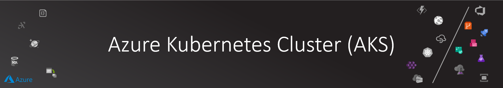

# AKS Cluster Provisioning

Now it is time to provision the star of the show, Azure Kubernetes Service cluster.

>NOTE: I have built an end-to-end [AKS cluster provisioning with advanced configuration](https://aka.ms/aks-adv-provision) that you can check out for more details.

## Essential Cluster Provisioning

### Variables

First we setup some AKS specific variables including the AKS version

```bash

# Have a look at the available versions first :)
az aks get-versions -l ${LOCATION} -o table

# Get latest AKS versions (note that this command will get the latest preview version if preview flag is activated)
AKS_VERSION=$(az aks get-versions -l ${LOCATION} --query 'orchestrators[-1].orchestratorVersion' -o tsv)
echo $AKS_VERSION

# To get the latest production supported version use the following (even if preview flag is activated):
AKS_VERSION=$(az aks get-versions -l ${LOCATION} --query "orchestrators[?isPreview==null].{Version:orchestratorVersion} | [-1]" -o tsv)
echo $AKS_VERSION

# Save the selected version
echo export AKS_VERSION=$AKS_VERSION >> ~/.bashrc

# Giving a friendly name to our default node pool
AKS_DEFAULT_NODEPOOL=npdefault

# AKS managed resources like worker nodes VMs, load balancers,... are created in a separate resource group.
# Here we are given it a friendly name :)
RG_NODES="${RG}-nodes";

```

### Service Principal Account

AKS needs a Service Principal account to authenticate against Azure ARM APIs so it can manage its resources (like worker VMs for example)

```bash

#***** Prepare Service Principal for AKS *****

# AKS Service Principal
# Docs: https://github.com/MicrosoftDocs/azure-docs/blob/master/articles/aks/kubernetes-service-principal.md
# AKS provision Azure resources based on the cluster needs, 
# like automatic provision of storage or creating public load balancer
# Also AKS needs to communicate with AzureRM APIs through that SP
# You can use the automatically generated SP if you omitted the SP configuration in AKS creation process

# To update existing AKS cluster SP, use the following command (when needed):
# az aks update-credentials \
#     --resource-group $RG \
#     --name $CLUSTER_NAME \
#     --reset-service-principal \
#     --service-principal $AKS_SP_ID \
#     --client-secret $AKS_SP_PASSWORD

#***** END Prepare Service Principal for AKS *****

```

### AKS Provisioning

```bash

# Be patient as the CLI provision the cluster :) maybe it is time to refresh your cup of coffee
# or append --no-wait then check the cluster provisioning status via:
# az aks list -o table

az aks create \
    --resource-group $RG \
    --node-resource-group $RG_NODES \
    --name $CLUSTER_NAME \
    --location $LOCATION \
    --kubernetes-version $AKS_VERSION \
    --generate-ssh-keys \
    --enable-addons monitoring \
    --load-balancer-sku standard \
    --network-plugin azure \
    --network-policy azure \
    --service-cidr 10.41.0.0/16 \
    --dns-service-ip 10.41.0.10 \
    --docker-bridge-address 172.17.0.1/16 \
    --vnet-subnet-id $AKS_SUBNET_ID \
    --nodepool-name $AKS_DEFAULT_NODEPOOL \
    --node-count 3 \
    --max-pods 30 \
    --node-vm-size "Standard_B2s" \
    --enable-vmss \
    --service-principal $AKS_SP_ID \
    --client-secret $AKS_SP_PASSWORD \

```

### Getting AKS Credentials

Now let's download kubectl context for our AKS cluster and test that it works

```bash

# Connecting to AKS via kubectl
az aks get-credentials --resource-group $RG --name $CLUSTER_NAME

# Test the connection
kubectl get nodes

```

## Next step

Congratulations on completing this section. Let's move to the next step:

[Next Step]()