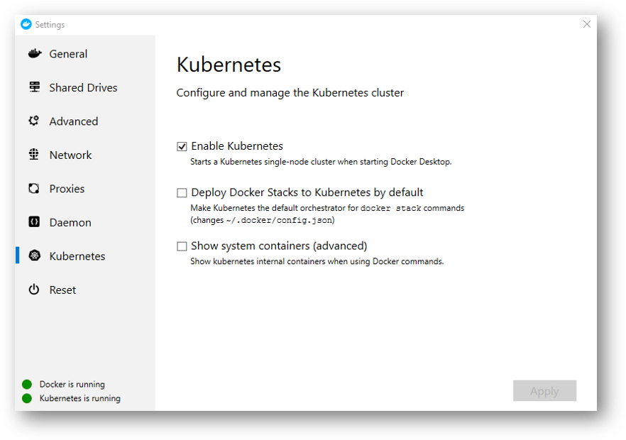

# IoT Edge

[Azure IoT Edge](https://docs.microsoft.com/en-us/azure/iot-edge/) is an Internet of Things (IoT) service that builds on top of IoT Hub. This service is meant for customers who want to analyze data on devices, or "at the edge," instead of in the cloud. By moving parts of your workload to the edge, your devices can spend less time sending messages to the cloud and react more quickly to events.

Gateways in IoT Edge solutions provide device connectivity and edge analytics to IoT devices that otherwise wouldn't have those capabilities.

Azure IoT Edge can be used to satisfy all needs for an IoT gateway regardless of whether they are related to connectivity, identity, or edge analytics.

Gateway patterns in this article only refer to characteristics of downstream device connectivity and device identity, not how device data is processed on the gateway.


## IoT Edge Device Options

The Crowd Analytics platform depends on having incoming camera feeds from IoT devices. IoT Edge runtime provides powerful way to not only manage these devices (auto provision, security, telemetry,..), give internet capability to devices that don't have (like a non-IP camera), but also allowing them to become intelligent as well.

For example having a simple face detection module running on the edge, the device will decide if it needs to send back the image or not.

>NOTE: In production, the recommended approach is to use Azure IoT Edge runtime to manage each camera device.

In the workshop, I opted to use a client that will access the camera feed and send it back to IoT Hub on the development machine. This will a little bit more simple.

## Installing IoT Edge

We will be building our IoT Edge on Linux to support advance future deployment to a Linux based real device (like Raspberry Pi).

>NOTE: In a production scenario, Windows devices should only run Windows containers. However, a common development scenario is to use a Windows computer to build IoT Edge modules for Linux devices. The IoT Edge runtime for Windows allows you to run Linux containers for **testing and development** purposes. Check the links later for the supported deployments instructions.

Full documentation on how to [install IoT Edge on Windows can be found here](https://docs.microsoft.com/en-us/azure/iot-edge/how-to-install-iot-edge-windows-with-linux)

### Manual Device Provisioning

We will use a manually registered edge device connection to provision and connect our new IoT Edge device.

```bash

DEVICE_ID="EdgeCam"

# Create new Edge Device in IoT Hub
az iot hub device-identity create \
    --device-id $DEVICE_ID \
    --hub-name $IOT_HUB_NAME \
    --edge-enabled

# List devices in IoT Hub. You should EdgeCam device with disconnected state
az iot hub device-identity list --hub-name $IOT_HUB_NAME

# Retrieve device connection string. Take note of that as we will use it during the runtime provisioning
EDGE_DEVICE_CONNECTION=$(az iot hub device-identity show-connection-string \
    --device-id $DEVICE_ID \
    --hub-name $IOT_HUB_NAME \
    --query connectionString -o tsv)
echo $EDGE_DEVICE_CONNECTION

```

>NOTE: In production scenarios, there are options for automating the device provision to support at scale provisions. Check the documentation for more information.

### Supported IoT Edge Deployment for Production

For production scenarios, please consider one of the following deployment:

#### IoT Edge on Linux

Linux on Linux containers deployment details can be [found here](https://docs.microsoft.com/en-us/azure/iot-edge/how-to-install-iot-edge-linux)

#### IoT Edge on Windows

Linux on Linux containers deployment details can be [found here](https://docs.microsoft.com/en-us/azure/iot-edge/how-to-install-iot-edge-windows)

### Installing IoT Edge Runtime

The IoT Edge runtime is deployed on all IoT Edge devices.
It has three components:

1. The **IoT Edge security** daemon starts each time an IoT Edge device boots and bootstraps the device by starting the other components.
2. The **IoT Edge agent** which manages deployment and monitoring of modules on the IoT Edge device, including the IoT Edge hub.
3. The **IoT Edge hub** handles communications between modules on the IoT Edge device, and between the device and IoT Hub.

### Provisioning on Windows VM

You can use Azure virtual machine as your **IoT Edge Device** if for some reason you can't use the development machine to install IoT Edge.

>NOTE: On Windows, IoT Edge Runtime only supported a specific version of Windows OS. You will most probably will not be able to deploy it on your Windows Dev machine that way. Instead, you can use the Kubernetes deployment option.

```bash

az vm create \
    --resource-group $RG \
    --name EdgeDeviceVM \
    --image MicrosoftWindowsDesktop:Windows-10:rs5-pro:latest \
    --admin-username azureuser \
    --admin-password {password} \
    --size Standard_DS1_v2

```

Navigate to your new Windows virtual machine in the Azure portal:

- Select **Connect**.
- On the RDP tab, select Download RDP File.
- Open this file with Remote Desktop Connection to connect to your Windows virtual machine using the administrator name and password you specified with the ```az vm create``` command.

Look for more details getting started check this [quick start](https://docs.microsoft.com/en-us/azure/iot-edge/quickstart).

Check [IoT Edge supported systems](https://docs.microsoft.com/en-us/azure/iot-edge/support) for more details.

>NOTE: You will find details in the links about on creating Linux VM or deploying to a Linux or Mac machines as well.

#### Docker Desktop (Only required for Windows)

>NOTE: It is worth mentioning this is also a critical to have Docker Desktop if you are using Windows as Edge device and building Linux containers. Docker Desktop must be in Linux containers mode.

If you are using Mac/Linux, you are good to go already :)

#### Deploy on Windows Device

Powershell script can be used to easily execute all the required commands to install IoT Edge on Windows.

>NOTE: The steps in this section all take place on your IoT Edge device, so you want to connect to that virtual machine now via remote desktop if you opted to use one.

Start a new PowerShell 64 session (x86 version will not work. You can know as the name will include x86) as an administrator.

>NOTE: I prefer using PowerShell ISE as it has a UI component that allows you to easily organize your code execution.


```powershell

# Deploy IoT Edge runtime
# The Deploy-IoTEdge command downloads and deploys the IoT Edge Security Daemon and its dependencies.
# You might need to reboot. Buckle up :)
. {Invoke-WebRequest -useb https://aka.ms/iotedge-win} | Invoke-Expression; `
Deploy-IoTEdge -ContainerOs Linux

# Initialize IoT Edge
. {Invoke-WebRequest -useb https://aka.ms/iotedge-win} | Invoke-Expression; `
Initialize-IoTEdge -DeviceConnectionString CONNECTION

```

When prompted, provide the device connection string that you retrieved previous step. The device connection string associates the physical device with a device ID in IoT Hub.

>NOTE:The device connection string takes the following format, and should not include quotation marks: ```HostName={IoT hub name}.azure-devices.net;DeviceId={device name};SharedAccessKey={key}```

Once completed, you can check the status of the IoT Edge service:

```powershell

# IoT Edge service be listed as running
Get-Service iotedge

# List running modules
iotedge list

```

>NOTE: A known Windows operating system issue prevents transition to sleep and hibernate power states when IoT Edge modules (process-isolated Windows Nano Server containers) are running. This issue impacts battery life on the device.

> As a workaround, use the command ```Stop-Service iotedge``` to stop any running IoT Edge modules before using these power states.

##### Updating IoT Edge Runtime

If you want to update the IoT Edge Runtime in the future, you can simply use the following:

```powershell

. {Invoke-WebRequest -useb https://aka.ms/iotedge-win} | Invoke-Expression; `
Update-IoTEdge -ContainerOs Linux

```

##### Uninstalling IoT Edge

Just run the following command:

```powershell

. {Invoke-WebRequest -useb aka.ms/iotedge-win} | Invoke-Expression; `
Uninstall-IoTEdge

```

This command removes the IoT Edge runtime, along with your existing configuration and the Moby engine data.

#### Deploy on Linux

For simplicity, deployment details can be [found here](https://docs.microsoft.com/en-us/azure/iot-edge/how-to-install-iot-edge-linux)

#### Deploy on Kubernetes (Preview)

Another great option to deploy IoT Edge runtime is Kubernetes.

You can even use your Docker Desktop provided Kubernetes or use Azure Kubernetes Services (or any other Kubernetes for that matter).

##### Local Kubernetes

For the workshop, we will leverage Docker Desktop built-in single Kubernetes cluster.

If you didn't already enabled it, head to Docker Desktop Settings -> Kubernetes and enable it.



For sure you already have a kubectl installed and probably connected to your AKS cluster. All what we need to do is to switch kubectl context to our ```docker-for-desktop``` Kubernetes cluster:

```bash

kubectl config get-contexts
kubectl config use-context docker-for-desktop

# Let's see how many nodes in our huge Kubernetes cluster :D
kubectl get nodes
# You should get something similar to:
# NAME             STATUS   ROLES    AGE   VERSION
# docker-desktop   Ready    master   11m   v1.14.7

```

>NOTE: For more documentation check [Docker Docs](https://docs.docker.com/docker-for-windows/#kubernetes)

##### Installing Helm

Just head to [Helm Docs](https://helm.sh/docs/intro/install/) to get documentation related to the installing for helm CLI.

>NOTE: You can also check [AKS-Adv-Provision](https://github.com/mohamedsaif/AKS-Adv-Provision) on GitHub for more details about helm and more (just search for helm).

Initialize helm (to install teller) on our Kubernetes cluster.

```bash

helm init
# You should get something like:
# $HELM_HOME has been configured at [some path/.helm].
# Tiller (the Helm server-side component) has been installed into your Kubernetes Cluster.

```

##### Adding IoT Edge Helm Repo

Simple, execute the following command:

```shell

helm repo add edgek8s https://edgek8s.blob.core.windows.net/helm/
helm repo update

```

##### Install IoT Edge

Helm makes deployment on Azure a smooth experience. Just execute the following commands to get started:

```shell

# Make sure you have your edge device connection string set correctly
helm install \
--name edge-cam \
--set "deviceConnectionString=${EDGE_DEVICE_CONNECTION}" \
edgek8s/edge-kubernetes

# You should recieve a detailed deployment report form teller:
# NAME:   edge-cam
# LAST DEPLOYED: Tue Nov 26 21:28:18 2019
# NAMESPACE: default
# STATUS: DEPLOYED

# RESOURCES:
# ==> v1/ClusterRoleBinding
# NAME                       AGE
# edge-cam-service-account  42s

# ==> v1/ConfigMap
# NAME                                             DATA  AGE
# edge-cam-edge-kubernetes-iotedged-proxy-config  1     42s

# ==> v1/Deployment
# NAME       READY  UP-TO-DATE  AVAILABLE  AGE
# edgeagent  0/1    1           0          42s
# iotedged   1/1    1           1          42s

# ==> v1/Namespace
# NAME                          STATUS  AGE
# msiot-ie22919-iothub-edgecam  Active  42s

# ==> v1/Pod(related)
# NAME                        READY  STATUS             RESTARTS  AGE
# edgeagent-6bd7bbfbfc-vxml7  0/2    ContainerCreating  0         42s
# iotedged-6f659595d-tg9tm    1/1    Running            0         42s

# ==> v1/Secret
# NAME                                       TYPE    DATA  AGE
# edge-cam-edge-kubernetes-iotedged-config  Opaque  1     42s

# ==> v1/Service
# NAME      TYPE       CLUSTER-IP     EXTERNAL-IP  PORT(S)              AGE
# iotedged  ClusterIP  10.103.42.156  <none>       35000/TCP,35001/TCP  42s

# ==> v1/ServiceAccount
# NAME                       SECRETS  AGE
# edge-cam-service-account  1        42s


# NOTES:
# Thank you for installing edge-kubernetes.

# Your release is named edge-cam.

# To learn more about the release, try:

#   $ helm status edge-cam
#   $ helm get edge-cam

# Your resources have been deployed to the namespace "msiot-ie22919-iothub-edgecam"

```

Take a note of the used namespace above to deploy the edge runtime components.

>NOTE: Installation use the following convention ```msiot-<iothub-name>-<edgedevice-name>``` in the namespace

##### Validate

```shell

kubectl get po -n REPLCAE_WITH_NAMESPACE
# NAME                         READY   STATUS    RESTARTS   AGE
# edgeagent-6bd7bbfbfc-vxml7   2/2     Running   0          5m4s
# iotedged-6f659595d-tg9tm     1/1     Running   0          5m4s

```

>NOTE: This guide is really great [How to install IoT Edge on Kubernetes](https://docs.microsoft.com/en-us/azure/iot-edge/how-to-install-iot-edge-kubernetes).