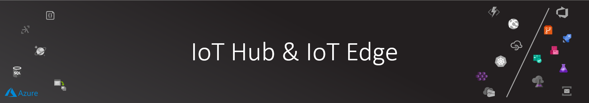

# IoT Hub IoT Device and IoT Edge Device

Azure IoT Hub is a managed service, hosted in the cloud, that acts as a central message hub for bi-directional 
communication between your IoT application and the devices it manages. You can use Azure IoT Hub to build 
IoT solutions with reliable and secure communications between millions of IoT devices and a cloud-hosted 
solution backend. You can connect virtually any device to IoT Hub.

[Read more about IoT Hub](https://docs.microsoft.com/en-us/azure/iot-hub/about-iot-hub)

Azure IoT Edge is a fully managed service built on Azure IoT Hub which allows you to deploy your cloud workloads—artificial intelligence, Azure and third-party services, or your own business logic—to run on Internet of Things (IoT) edge devices via standard containers (like a Raspberry PI type device). By moving certain workloads to the edge of the network, your devices spend less time communicating with the cloud, react more quickly to local changes, and operate reliably even in extended offline periods.

[Read more about IoT Edge](https://azure.microsoft.com/en-us/services/iot-edge/)

## Azure CLI Extension for IoT

To enable additional functionality of Azure CLI, you need to make sure that IoT extension is installed:

```bash

az extension add --name azure-cli-iot-ext

```

>NOTE: This is important steps to execute IoT Hub specific commands like creating a device identity.

## IoT Hub Provisioning

```bash

# Be patient as this would take a few mins
IOT_HUB_NAME="${PREFIX}-iothub"
az iot hub create \
    --name $IOT_HUB_NAME \
    --resource-group $RG \
    --sku S1

# If you wish to get the IoT Hub connection string (maybe to connect a Device Explorer to it) use the following:
# This command get the default policy and primary key connection string
az iot hub show-connection-string --name $IOT_HUB_NAME

## Enabling File Upload feature in IoT Hub
# Docs: https://docs.microsoft.com/en-us/azure/iot-hub/iot-hub-configure-file-upload-cli
# Get the storage account to be used by IoT Hub
# Note: refer back to the prerequisites guide for details
echo $FRAMES_STORAGE_CONN
echo $FRAMES_STORAGE_CONTAINER

# Enable File Upload feature by linking IoT Hub to a Azure Storage account.
# Set storage connection string
az iot hub update \
    --name $IOT_HUB_NAME \
    --fileupload-storage-connectionstring "$FRAMES_STORAGE_CONN" \
    --fileupload-storage-container-name "$FRAMES_STORAGE_CONTAINER"

az iot hub update \
    --name $IOT_HUB_NAME \
    --add properties.storageEndpoints.'$default'.connectionString="$FRAMES_STORAGE_CONN"

# Set storage container name
az iot hub update \
    --name $IOT_HUB_NAME \
    --set properties.storageEndpoints.'$default'.containerName=$FRAMES_STORAGE_CONTAINER

# Shared Access Signature Time to Live: 1 hour (a device have 1 hour to upload or the temp key will expire)
az iot hub update \
    --name $IOT_HUB_NAME \
    --set properties.storageEndpoints.'$default'.sasTtlAsIso8601=PT1H0M0S

# Enable upload notification
az iot hub update --name $IOT_HUB_NAME \
  --set properties.enableFileUploadNotifications=true

# Maximum number of times the IoT Hub attempts to deliver a file upload notification. Set to 10 by default
az iot hub update --name $IOT_HUB_NAME \
  --set properties.messagingEndpoints.fileNotifications.maxDeliveryCount=100

# Notification Time to Live (one day by default)
az iot hub update --name $IOT_HUB_NAME \
  --set properties.messagingEndpoints.fileNotifications.ttlAsIso8601=PT1H0M0S

# Review the IoT Hub updated settings:
az iot hub show --name $IOT_HUB_NAME

```

## IoT Hub Routing to Service Bus

Crowd Analytics core services leverages Service Bus Topics to orchestrate event driven processing of captured frames.

Creating IoT Hub messages route to Service Bus Topic will instruct received messages in IoT Hub that have a specific filter (```CognitiveAction=CamFrameAnalysis```) to be routed to ```cognitive-request``` Service Bus Topic.

You can read [IoT Hub message routing to send device-to-cloud messages to different endpoints](https://docs.microsoft.com/en-us/azure/iot-hub/iot-hub-devguide-messages-d2c) for more information.

```bash

# From a previous step in the prerequisites guide, you created an authorization rule for the (cognitive-request) topic
echo $SB_TOPIC_ORCH_CONNECTION

# We will need the subscription id:
SUB_ID=$(az account show --query id -o tsv)

# Setup some variables
ENDPOINT_NAME="cognitive-request-sb-topic"
ENDPOINT_TYPE="ServiceBusTopic"
ROUTE_NAME="cognitive-request-sb-topic-route"
CONDITION='$body.TargetAction="CamFrameAnalysis"'

# Register routing endpoint for the Service Bus topic.
# This uses the Service Bus topic connection string.
az iot hub routing-endpoint create \
  --connection-string $SB_TOPIC_ORCH_CONNECTION \
  --endpoint-name $ENDPOINT_NAME \
  --endpoint-resource-group $RG \
    --endpoint-subscription-id $SUB_ID \
  --endpoint-type $ENDPOINT_TYPE \
  --hub-name $IOT_HUB_NAME \
  --resource-group $RG

# Set up the message route for the Service Bus queue endpoint.
az iot hub route create \
  --name $ROUTE_NAME \
  --hub-name $IOT_HUB_NAME \
  --source-type devicemessages \
  --resource-group $RG \
  --endpoint-name $ENDPOINT_NAME \
  --enabled \
  --condition $CONDITION

```

## IoT Device Options

[Azure IoT Edge](https://docs.microsoft.com/en-us/azure/iot-edge/) is an Internet of Things (IoT) service that builds on top of IoT Hub. This service is meant for customers who want to analyze data on devices, or "at the edge," instead of in the cloud. By moving parts of your workload to the edge, your devices can spend less time sending messages to the cloud and react more quickly to events.

Gateways in IoT Edge solutions provide device connectivity and edge analytics to IoT devices that otherwise wouldn't have those capabilities.

Azure IoT Edge can be used to satisfy all needs for an IoT gateway regardless of whether they are related to connectivity, identity, or edge analytics.

Gateway patterns in this article only refer to characteristics of downstream device connectivity and device identity, not how device data is processed on the gateway.


## IoT Edge Device.. Workshop Style 🐱‍👓

In the workshop, I've wanted to have the IoT Hub Client as close as possible to a production development. I've decided to put 2 components to work:

1. **Camera Device:** A simple ASP .NET Core website that uses your dev machine camera and save it to disk using a predefine FPS (frame per second). It will always capture and save the image and send a device-to-cloud message/upload the files to IoT Hub.
2. OPTIONAL: **IoT Edge Device:** Check out [IoT-Edge Runtime Guide](IOT-EDGE.md) if you are interested to have an IoT Edge Device for details.

What will be doing is:

### Cam Device (Web)

You can check the [Cam Device Web](../../src/iot/Cam.Device.Web) for the project source code.

### Manual Device Provisioning

We will use a manually registered IoT Hub device connection to provision and connect our new Cam Device (Web).

```bash

WEB_DEVICE_ID="WebCam001"

# Create new Edge Device in IoT Hub
az iot hub device-identity create \
    --device-id $WEB_DEVICE_ID \
    --hub-name $IOT_HUB_NAME

# List devices in IoT Hub. You should EdgeCam device with disconnected state
az iot hub device-identity list --hub-name $IOT_HUB_NAME

# Retrieve device connection string. Take note of that as we will use it during the runtime provisioning
WEBCAM_DEVICE_CONNECTION=$(az iot hub device-identity show-connection-string \
    --device-id $WEB_DEVICE_ID \
    --hub-name $IOT_HUB_NAME \
    --query connectionString -o tsv)
echo $WEBCAM_DEVICE_CONNECTION

```

>NOTE: In production scenarios, there are options for automating the device provision to support at scale provisions. Check the [documentation](https://docs.microsoft.com/en-us/azure/iot-hub/iot-hub-automatic-device-management-cli) for more information.

### Updating the Cam Device Web Settings

Don't forget to update the  ```appsettings.json``` with the relevant values.

You can simply open it in VS Code or Visual Studio and run it.
