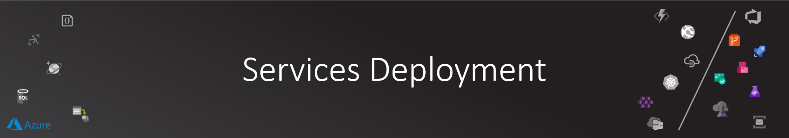

# Services Deployment

Now it is time to deploy and activate the solution.

## DevOps Setup

I'm hosting the source code on GitHub and using Azure DevOps to manage the other aspects of SDL (Azure Boards for project management, Azure Pipelines for CI/CD and Azure Artifacts for custom NuGet packages).

### Connecting to Azure

Azure DevOps allows you to provision secure service connection to many external systems (like Azure Resource Manager and Container Registry).

[Service Connections](https://docs.microsoft.com/en-us/azure/devops/pipelines/library/service-endpoints?view=azure-devops&tabs=yaml) can be used to access external systems in your build and release pipelines.

#### Azure Container Registry Service Connection

Let's add Azure Container Registry service connection so Azure DevOps can push images to be pulled by Kubernetes.

Head up to **Project settings -> Service connections -> New service connection**:

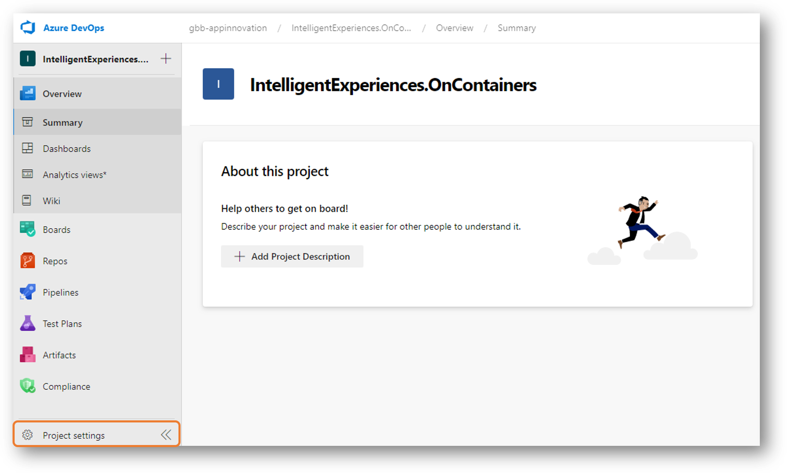

In the new service connection drop-down list, select **Docker Registry**:

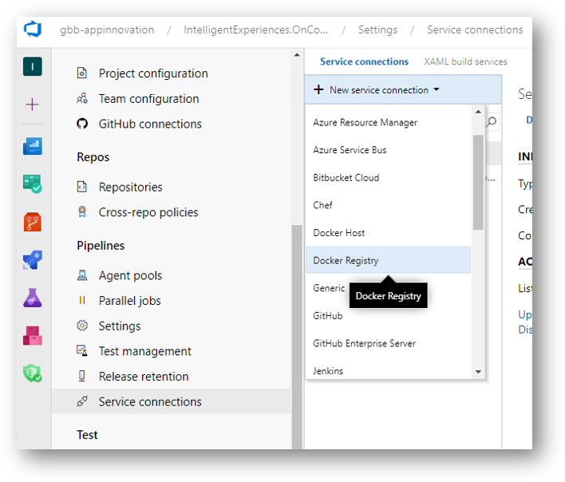

Azure DevOps has tight integration with Azure, so you will find an option for (Azure Container Registry) which you select a subscription and registry and Azure DevOps will provision all the authentication/authorization plumbing on your behalf.

I opted to use **Others** option so it would not matter where that container registry is. I just supplied a registry information:


>NOTE: At previous step, we created both Azure Container Registry and a Service Principal. Refer back to this step to get the access information needed to create the new service connection.

#### Azure Kubernetes Service

As you will be deploying the platform services on AKS, I've opted to create another service connection to **Kubernetes**.

You can use Kubeconfig, Kubernetes Service Account or Azure Subscription. Azure Subscription is the easiest option as again all the configuration will handled on your behalf.

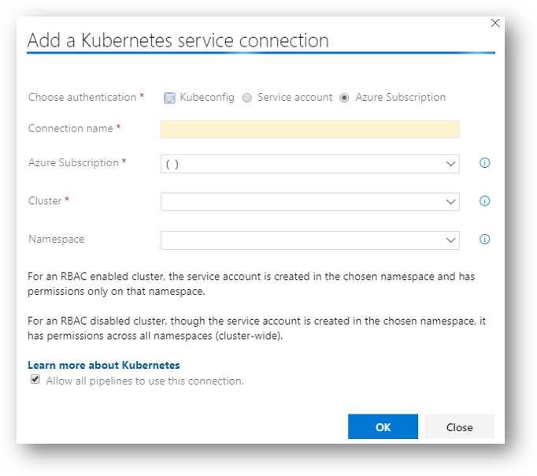

### Source Code

If you want to contribute to this workshop (which I would very much appreciate), I would recommend [Forking the GitHub repo](https://aka.ms/IE-On-Containers).

If you wish to use [Azure Repos](https://azure.microsoft.com/en-us/services/devops/repos/) that is an awesome option as well :)

If you wish to clone it and upload it to other source control platforms, then this what you should do :)

>NOTE: In this workshop guide, I will focus only in one option just to remain focused on the objectives of learning end-to-end life cycle of building and deploying cloud native workloads.

You can start for free on [Azure DevOps](https://azure.microsoft.com/en-us/services/devops/?nav=min). Just click on "Start free >" and create your organization.

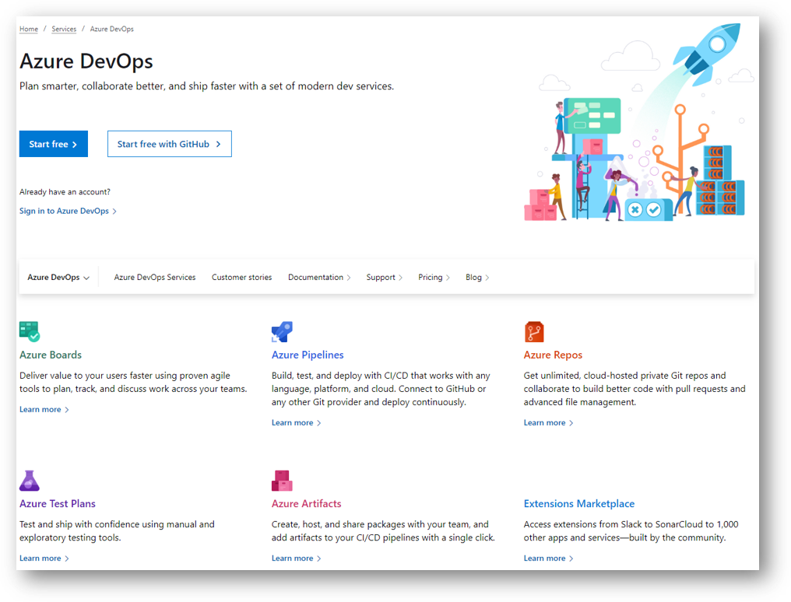

Create your a new Azure DevOps project, and setup the initial options

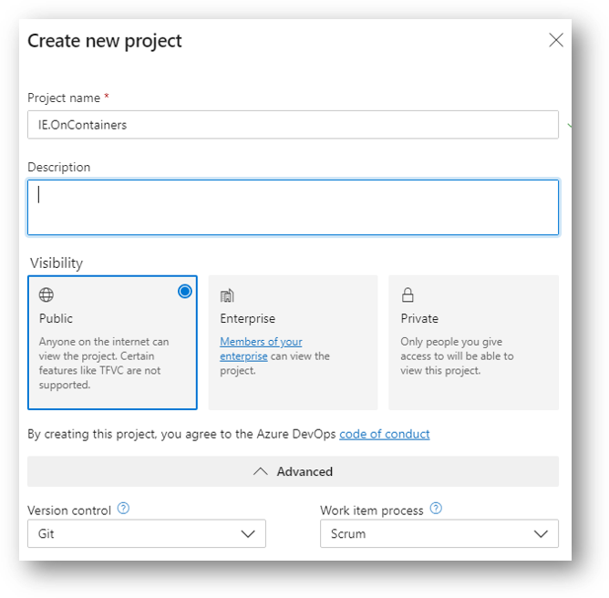

Once you have your code forked or cloned with Azure DevOps project in place, you are ready to proceed.

### Continuos Integration

The workshop leverages Azure Pipelines yaml configuration checked at the root of this workshop code.

#### Importing Pipelines

Overview of CI pipelines:

- Service: CognitiveOrchestrator
- Service: CamFrameAnalyzer
- Service: CrowdAnalyzer
- NuGet: CoreLib
- NuGet: CognitiveServicesHelpers
  
To start importing these pipelines into your Azure DevOps project, just click on New Pipeline under (Pipelines -> Builds)

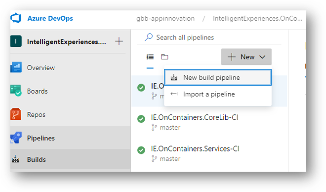

Select (GitHub YAML) or (Azure Repos Git YAML) based on where is your code:

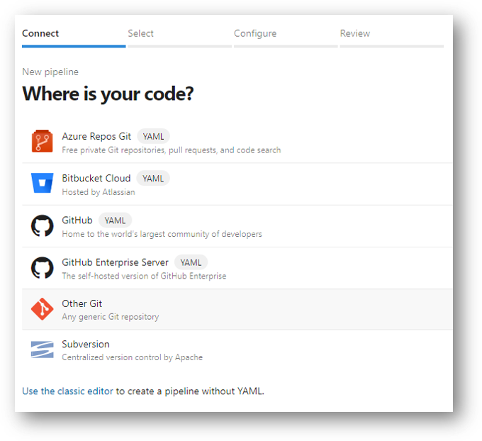

>NOTE: Selecting GitHub for the first time, you will need to connect Azure DevOps to your GitHub account. If you have challenges, you can review the following lab [Integrate Your GitHub Projects With Azure Pipelines](https://azuredevopslabs.com//labs/azuredevops/github-integration/)

Next you select the project repo. It will differ based on you selection in the previous step:

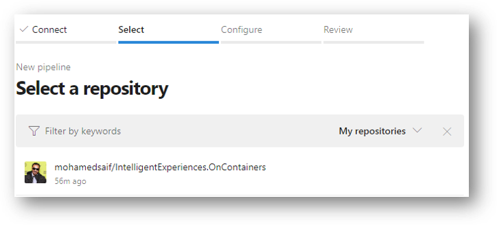

As we are not starting from scratch, you can select **Existing Azure Pipelines YAML file**:

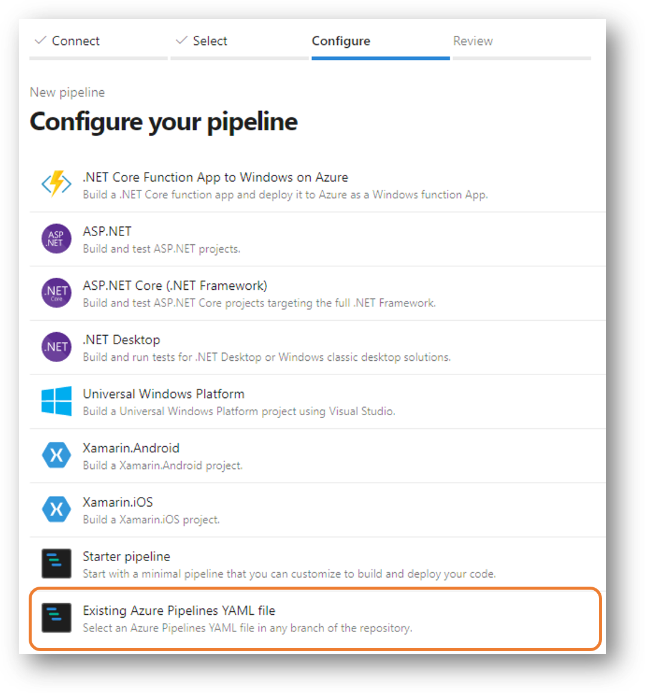

Select on of the yaml files:

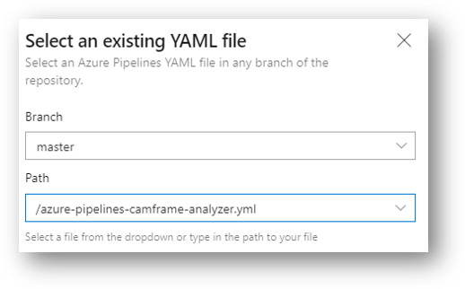

Finally review the content of the yaml file and click on Run to queue a new build process:

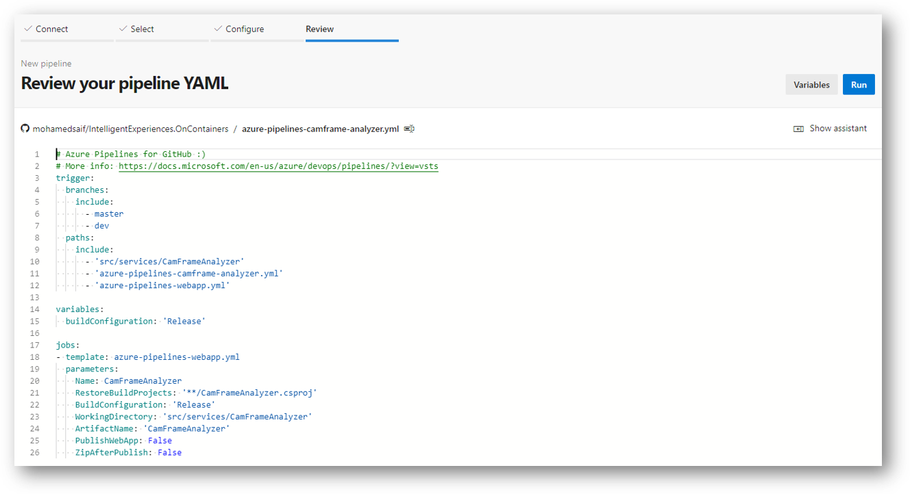

CONGRATULATIONS! You first pipeline is now being built.

Please repeat the above steps for each pipeline mentioned (only the template files will not be included. These files end with angular, webapp, nuget and tests)

>NOTE: My Azure Artifacts repo used in public, so you shouldn't face problems restoring the packages I've pushed their. If you received errors in the build, it is worth mentioning that you might need to setup an Azure Artifacts repo, push the Workshop NuGet packages to and then try to build again after updating your nuget.config files with the new source.

>NOTE: Check [Azure Artifacts](https://docs.microsoft.com/en-us/azure/devops/artifacts/get-started-nuget?view=azure-devops) documentations for more information or check our a blog post about [Public Azure Artifacts Feeds](https://devblogs.microsoft.com/devops/new-with-azure-artifacts-public-and-project-scoped-feeds/)

### Continuos Delivery

Creating Release Pipelines to actually deliver the target services to your Azure cloud services.

>NOTE: You will need all the connection strings, keys and values you captured during the previous workshop steps to provision your release pipelines.

## Testing

Now you are ready to check as experienced SRE (Site Reliability Engineering) that the deployed components are up and healthy.

### Kubernetes Services Test

Let's check that every part of the deployment works

#### Crowd Analytics Components

You have mainly 3 components running:

- Cognitive Orchestrator: gets any new messages coming from IoT Hub and send them to the appropriate processor. Currently we have only [Camera Frame Analyzer] service.
- CamFrame Analyzer: look for faces in image, persist similar faces and identify any faces agains a predefined list and then publish frame analysis results with basic demographics information.
- Crowd Analyzer: taking an analyzed Camera Frame and produced 1-hour demographics view (total males, total females, age groups, emotions,...) and persist the results in db so it can be displayed in a dashboard.

All services are deployed to AKS in a namespace called [crowd-analytics]. Let's check all deployments:

```bash

kubectl get deployment -n crowd-analytics

# Results could look like this:
# NAME                     READY   UP-TO-DATE   AVAILABLE   AGE
# camframe-analyzer        0/0     0            0           93m
# cognitive-orchestrator   1/1     1            1           14h
# crowd-analyzer           0/0     0            0           12m

# You can get details about a specific deployment using:
kubectl describe deployment camframe-analyzer -n crowd-analytics

# Check the deployed pods (if you have all 0 you will not get any results)
kubectl get pods -n crowd-analytics

# In addition to the above, you can access KEDA scaler logs as well:
kubectl get pods -n keda

kubectl logs REPLACE_KEDA_POD_NAME -n keda

# Save logs to a file
kubectl logs REPLACE_KEDA_POD_NAME -n keda > keda.logs

```

One of the amazing aspects of KEDA's ```ScaledObject``` that it can scale down to 0 and scale up to N based on the event trigger (in this case we are using Service Bus trigger).

>NOTE: In KEDA ```ScaledObject``` definition for each service, you can set the ```minReplicaCount``` to 0 like in camframe-analyzer. I've set the cognitive-orchestrator minimum to 1 (that is why it show 1/1).