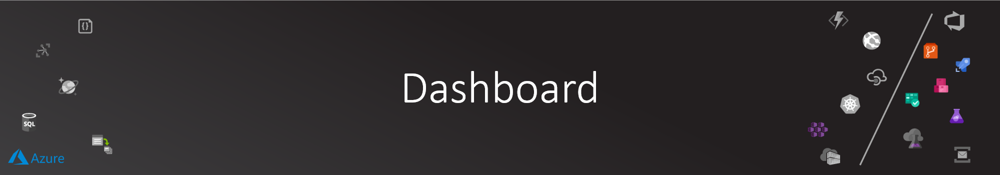

# Power BI Dashboard

Now you have the system up and running and you are receiving essential KPIs that will be interesting to the management.

Business stake holders usually don't access Azure Portal to view Cosmos db json documents, they usually use a powerful visualization platform.

I've decided to create the Crowd-Analytics dashboard in the powerful [PowerBI](https://powerbi.microsoft.com/en-us/) for data analysis. This will allow business analyst to generate all the reports and dashboards without through a self-service style with no coding at all, and let the developers to focus on making sure that system provide the metrics needed for the decisions making.

In the following steps, we will create the dashboard shown below:

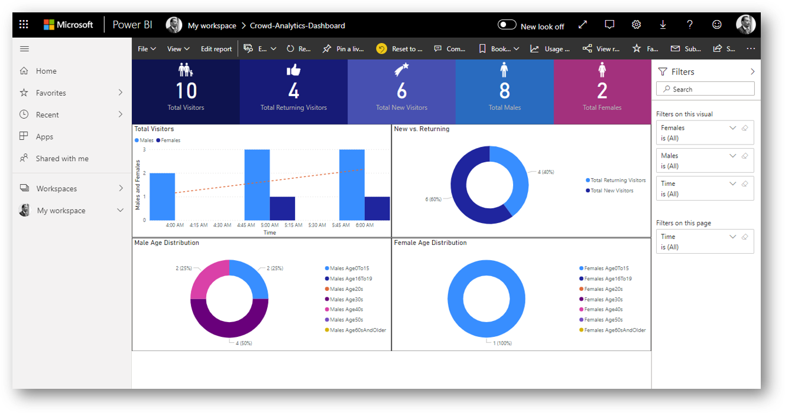

Right out of the box, the dashboard will allow users to filer data by just clicking on one data point on the chart:

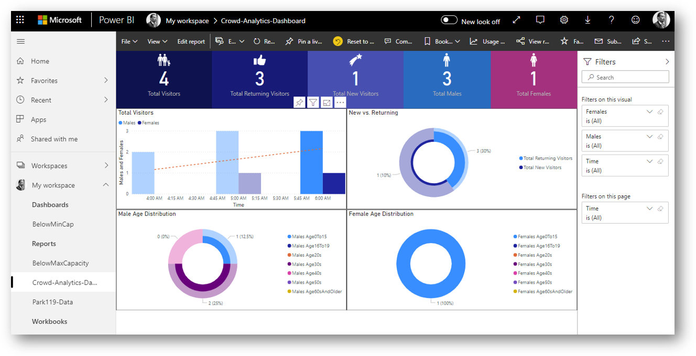

## PowerBI Desktop

The ultimate choice for creating powerful dashboard and reports for PowerBI is to use [PowerBI Desktop](https://powerbi.microsoft.com/en-us/desktop/). If you are on a Windows machine, head right away and install the tool.

>NOTE: Currently there is no Mac version of PowerBI Desktop. If you still want to use the make I would suggest using Mac's dual boot, Parallels or Turbo.net

Sign-in or sign-up for your account (a lot of companies already have PowerBI license).

>NOTE: for another example, check out this [Visualize Azure Cosmos DB data by using the Power BI connector](https://docs.microsoft.com/en-us/azure/cosmos-db/powerbi-visualize)

## Connect to Cosmos Db

Once your are on the empty report view in PowerBI Desktop, click on Get Data and search for Cosmos connector:

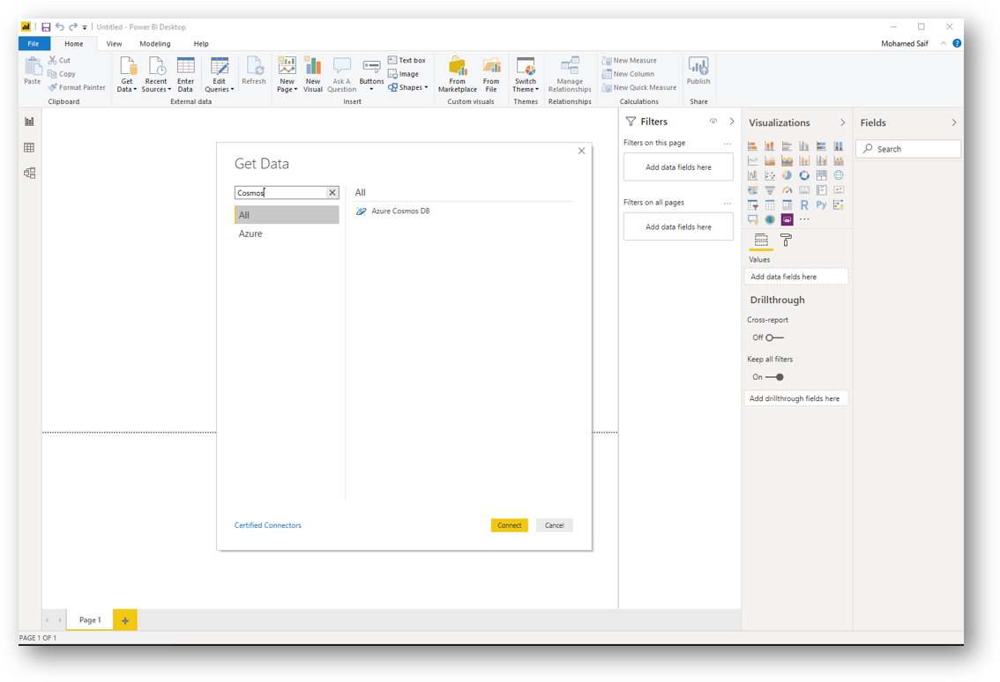

Finish up the Cosmos db connection settings (endpoint, database name and get a read-only key from Azure Portal for your Cosmos Db).

>NOTE: Below is an example of where you can get Cosmos db connection details needed:
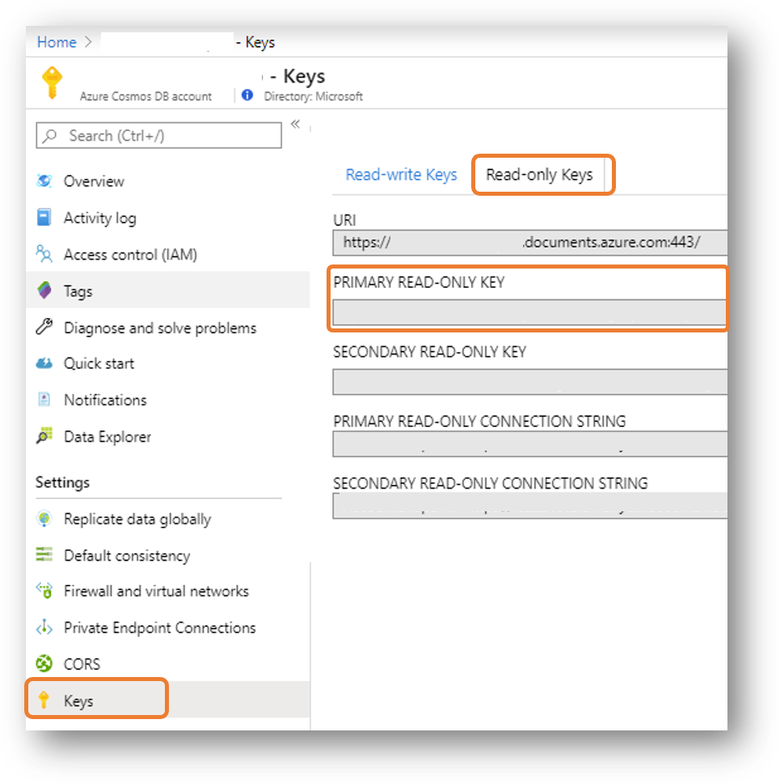

Select **crowd-demographics** collection and click load:

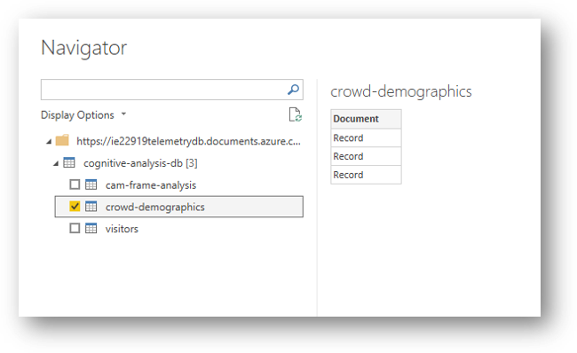

## Query Edit and Data Prep

Once you've finished loading the data, you can select **Edit Query** in the main toolbar, and in the query editor expand the document (as by default, Cosmos container is an array for json documents):

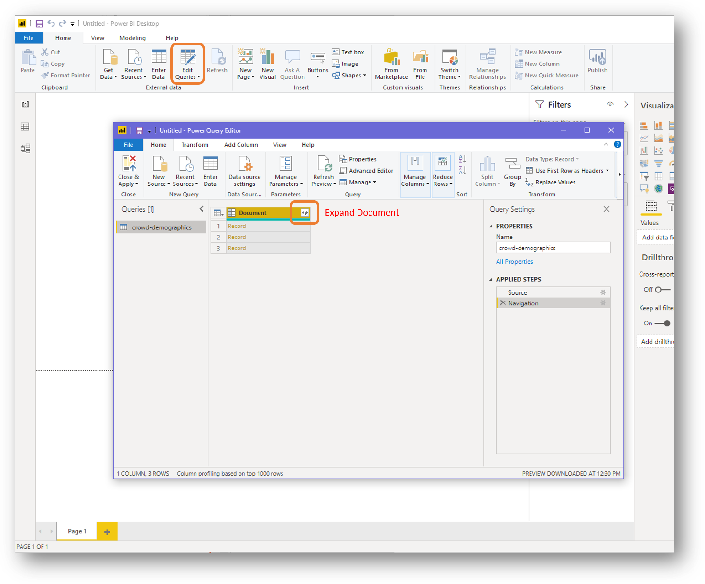

It will show you a list of columns to be expanded. Just deselect all the Cosmos Db related attributes (like _self...).

Now you should see a flat table of your data:

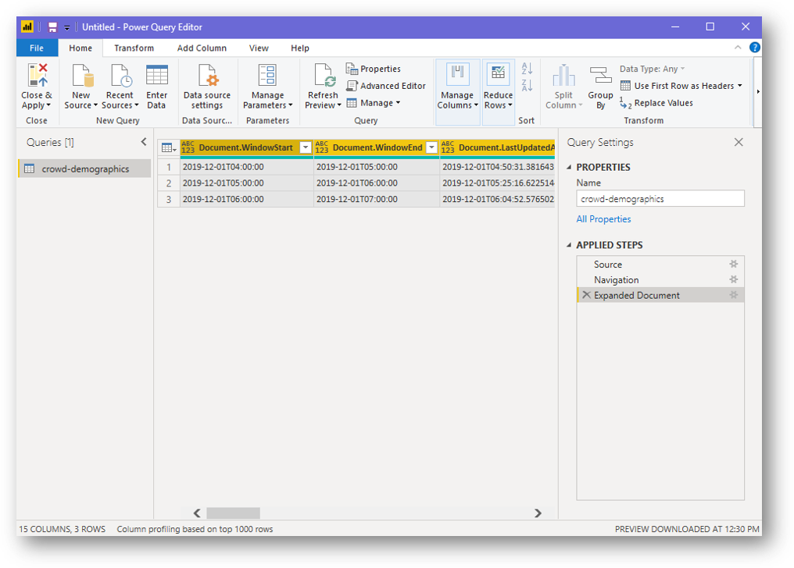

As we have a nested documents for AgeGenderDistribution and Emotion, you need to expand these as well.

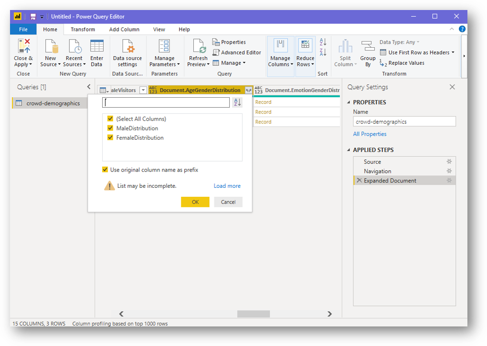

Keep expanding all nested documents until you have a fully flat table.

Next we update the colum names and data types (like changing ```Document.WindowStart``` to just ```Start```). You can do this by right clicking the column and select Rename:

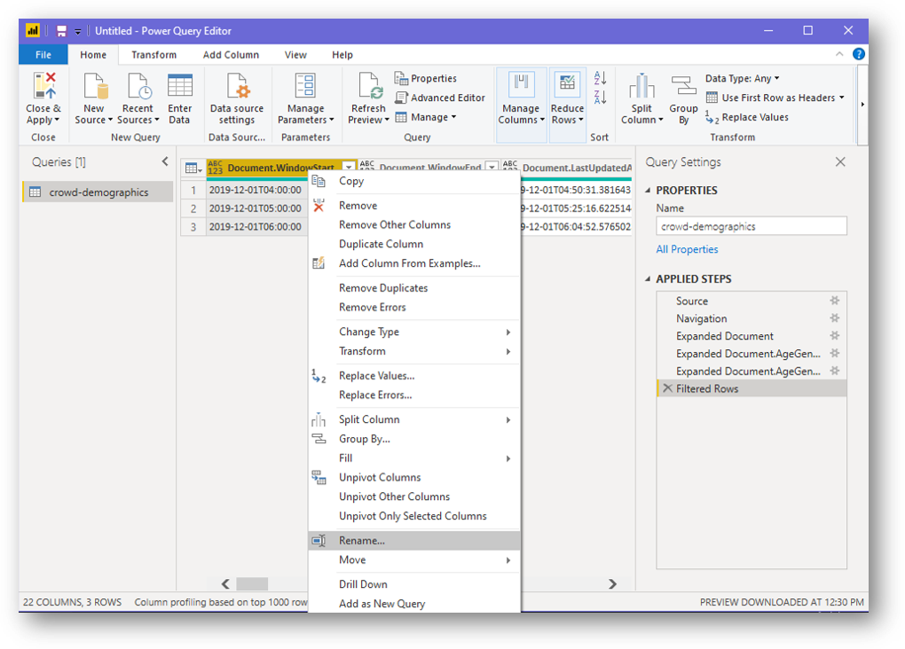

Also change the data type to the relevant types (our dashboard has only Date/Time and Whole Number):

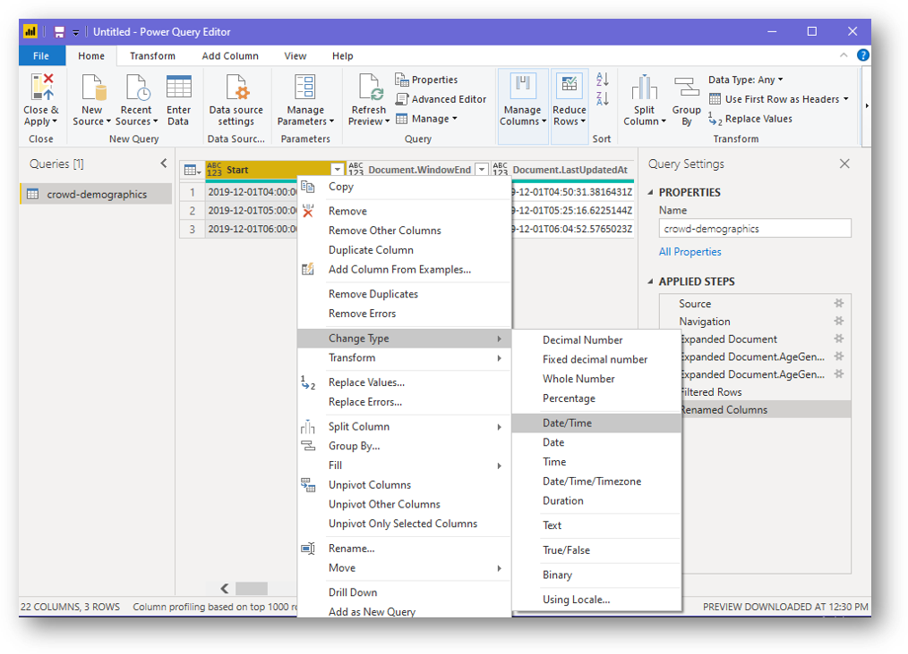

Repeat the above steps to cover all columns and once you finished, click on the first button in the toolbar that says **Close & Apply**.

## Design the Report

Now in the report designer, you can click on one of the visualization options (like clustered bar chart), and setup the Axis and Value from the available fields:

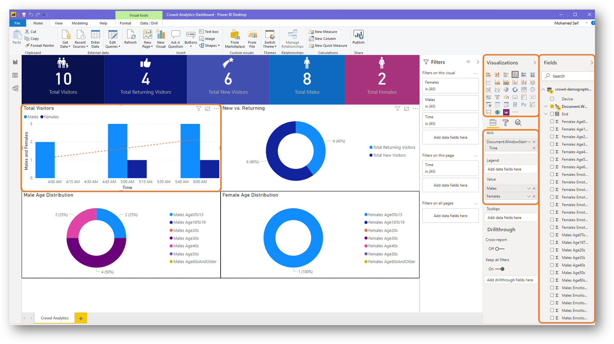

Experiment and create something that you believe is a valuable report to the management.

Click on one chart to see how it filters the others based on your selection.

## Publish

After you finished, you can click Publish to publish the report on PowerPI workspace so it can be shared with the target users (if you have corporate license, it can be controlled like many other Office related services like SharePoint)

You are done with your very fast dashboard.