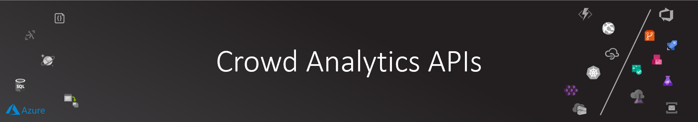

# Crowd Analytics APIs

As you start to need to control and manage the crowd analytics platform, a need for a centralized APIs to expose additional functionality in included in [CognitiveOrchestrator.API](../../src/apis/CognitiveOrchestrator.API/) project.

APIs offered would cover the following functionalities:

- Orchestrator APIs: allow external systems to push camera frames directly (without the IoT Hub) to the system.
- Identification APIs: allow various operations related to management of visitors identification (create visitors group, add identified visitors to a group, train the system on newly added visitors).

Deployment of these APIs is done through Azure DevOps.

## APIs DevOps

### Continuos Integration

Head back to Azure DevOps Pipelines to introduce a new pipeline to build and publish the image for the APIs project.

Pipeline definition can be found in [azure-pipelines-cognitive-apis.yml](../../azure-pipelines-cognitive-apis.yml) at the root of this repo.

Follow the same procedure as you did with the other pipelines to import this build definition to the Azure DevOps pipelines.

Run your new pipeline at least once successfully before proceeding with the next step.

### Continuos Deployment

Once you have the image pushed to your ACR and the deployment files published as artifact in the pipeline, you can head to Azure DevOps releases to import the release definition for the pipeline.

Again with following similar steps done in previous release pipelines, you can configure the new API release pipeline:

- Delete/add the new pipeline artifact
- Update the [Dev] stage tasks to use the Kubernetes service account
- Update the needed variables

Save and create a release for the new pipeline.

## API Testing

You can use what ever tool you want to use to test the newly deployed APIs. I'm using Postman for the job.
