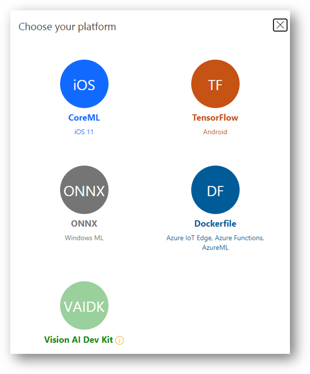
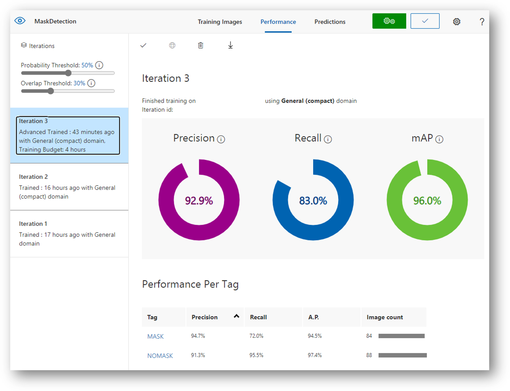
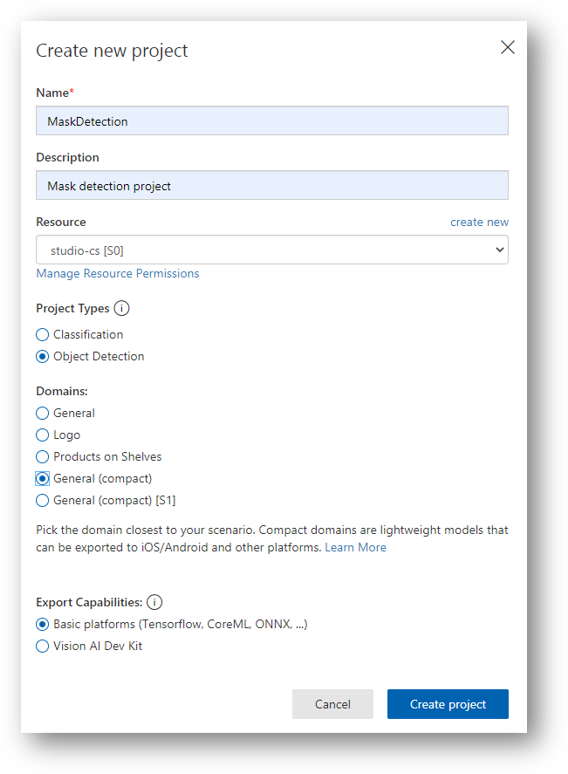
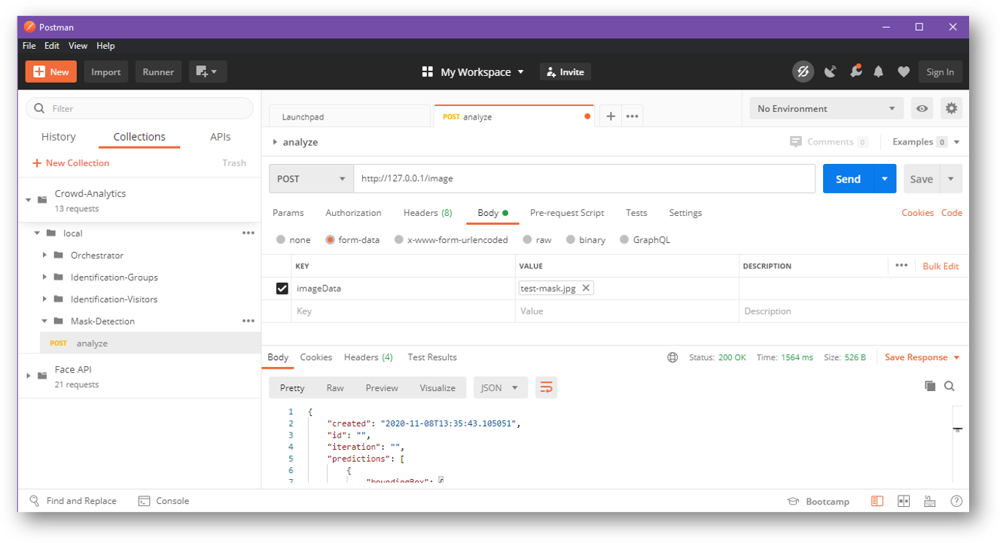

# Mask Detection Model

This model is generated via [Azure Custom Vision](https://www.customvision.ai/) object detection service.

Custom Vision service allows you to build custom models based on your specific scenario.

It can do for example image classification and object detection.

Models created by the Custom Vision service can be used in several ways:
1. Publish an endpoint directly through the customer vision service and securely access it via HTTP rest calls or using one of the SDKs
2. Export the model to many formats (only available with compact categories) like CoreML, TensorFlow, Dockerfile,...



The model I've trained for this workshop included around 200 images split between MASK and NOMASK:



If you want to try to build you own custom model with maybe improved performance, these are the steps:
1. Compile 150-300 images split between masks and no-masks with about 10-20 or so dedicated for testing
2. Create new custom vision project by visiting [Azure Custom Vision](https://www.customvision.ai/)
   - Project type should be **object detection** and domain is **general (compact)**
3. Upload your training images to your project and start tagging the images with (MASK and NOMASK) tags
4. Train the project
5. Test the trained model through the quick test feature by uploading one or more test images
6. Export the model in the appropriate format for your software.



In my case, I used a Dockerfile to generate a container for the inference endpoints. This container is built by Azure DevOps and deployed to the AKS cluster.

>NOTE: you can rely on the self-hosting capability of custom vision service using the published endpoint if you don't want to generate a container and deploy it to something like AKS

## Custom Vision Dockerfile

Exported from [customvision.ai](https://customvision.ai)

### Build

```bash
docker build -t <your image name> .
```

#### Build ARM container on x64 machine

Export "ARM" Dockerfile from customvision.ai. Then build it using docker buildx command.
```bash
docker buildx build --platform linux/arm/v7 -t <your image name> --load .
```

### Run the container locally

```bash
docker run -p 127.0.0.1:80:80 -d <your image name>
```

### Image resizing

By default, we run manual image resizing to maintain parity with CVS webservice prediction results.
If parity is not required, you can enable faster image resizing by uncommenting the lines installing OpenCV in the Dockerfile.

## Testing the service

Then use your favorite tool to connect to the end points.

POST http://127.0.0.1/image with multipart/form-data using the imageData key
e.g
```
    curl -X POST http://127.0.0.1/image -F imageData=@some_file_name.jpg
```

POST http://127.0.0.1/image with application/octet-stream
e.g.
```
    curl -X POST http://127.0.0.1/image -H "Content-Type: application/octet-stream" --data-binary @some_file_name.jpg
```

POST http://127.0.0.1/url with a json body of { "url": "<test url here>" }
e.g.
```
    curl -X POST http://127.0.0.1/url -d '{ "url": "<test url here>" }'
```

>NOTE: For information on how to use these files to create and deploy through AzureML check out the readme.txt in the azureml directory.

### Using Postman

Using Postman might be handy for a lot of developers.

Just create a new http post request with the service exposed IP and you are ready to rock:



### Sample output

#### No-Mask

```json

{
    "created": "2020-11-08T13:34:16.506009",
    "id": "",
    "iteration": "",
    "predictions": [
        {
            "boundingBox": {
                "height": 0.6072564,
                "left": 0.22894679,
                "top": 0.18516936,
                "width": 0.32178198
            },
            "probability": 0.92134517,
            "tagId": 1,
            "tagName": "NOMASK"
        }
    ],
    "project": ""
}

```

#### Mask

```json

{
    "created": "2020-11-08T13:35:43.105051",
    "id": "",
    "iteration": "",
    "predictions": [
        {
            "boundingBox": {
                "height": 0.38818307,
                "left": 0.20535451,
                "top": 0.03156353,
                "width": 0.16967412
            },
            "probability": 0.89423954,
            "tagId": 0,
            "tagName": "MASK"
        },
        {
            "boundingBox": {
                "height": 0.3918476,
                "left": 0.61672936,
                "top": 0.01001004,
                "width": 0.21205512
            },
            "probability": 0.84088373,
            "tagId": 0,
            "tagName": "MASK"
        }
    ],
    "project": ""
}

```
